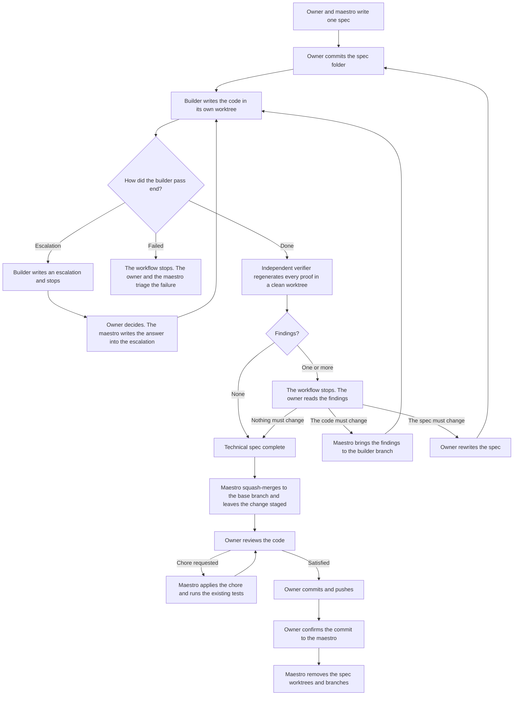

# Contributing workflow

This file explains how work moves through the repository. It does not define the rules.
[AGENTS_CONTRIBUTING.md](AGENTS_CONTRIBUTING.md) defines them. If the two disagree, that file wins.

## The idea

One spec describes one small reversible change. An agent builds it. A second, independent agent
regenerates every proof from scratch. The owner makes the final review alongside the commit on the base branch.

Three principles hold the workflow together:

- No agent approves its own work.
- A check that passes must be able to fail. Each acceptance criterion states the breakage that must break it.
- An agent never decides for the owner, and never guesses.

The owner talks to the maestro. The maestro talks to the builders and the verifiers.

## The roles

- **Owner** — You. You bring the problem, decide every escalation and every finding, review the final code, and make every commit on the base branch. You never talk to a builder or a verifier.
- **Maestro** — The agent you talk to. It writes the spec with you, creates the branches and the worktrees, spawns and supervises the other agents, records your decisions, and removes the completed spec worktrees and branches after you confirm the final commit. It writes no product code.
- **Builder** — The agent that implements one spec in its own worktree and records its observations. It never verifies its own work, and never touches a path the spec does not list.
- **Verifier** — The agent that regenerates every probe and every breakage from scratch, in a clean worktree at the commit under verification. It reports findings and repairs nothing. It never gives a verdict.

## The flow

## Step by step

The steps below follow the diagram, one for each box and each decision.

1. **The owner and the maestro write one spec.** They agree on the problem, the options, and the constraints. The spec lists the allowed paths and the acceptance criteria. A spec that introduces a new visual surface also gets one or more standalone HTML prototypes in `.specs/<id>/prototypes/`. The maestro could also make them before the work starts. They show the intended visual result and do not operate. A spec that only changes existing UI covers the visual result with an acceptance criterion instead.
2. **The owner commits the spec folder.** The agents start from the committed state.
3. **The builder writes the code in its own worktree.** The builder records its observations and its handoff, and commits them in its worktree.
4. **How did the builder pass end?** A pass ends with exactly one terminal handoff, and there are three of them.
   - An escalation. The builder cannot finish without an owner decision. It writes the escalation and stops. The owner decides. The maestro writes the answer into the escalation. The work continues at step 3.
   - `failed`. The builder cannot produce a verifiable candidate with the current spec, constraints, and environment. The flow stops here. The owner and the maestro triage the failure outside it.
   - `done`. Continue at step 5.
5. **An independent verifier regenerates every proof in a clean worktree.** The verifier does each probe again. It also does each breakage again. Then it commits its findings.
6. **Are there findings?**
   - None. The technical spec is complete. Continue at step 8.
   - One finding or more. The workflow stops. Continue at step 7.
7. **The owner reads the findings.** There are three ways out.
   - Nothing must change. The maestro writes the reason into each finding that the owner rejects. The technical spec is complete. Continue at step 8.
   - The code must change. The maestro brings the findings to the builder branch. The work continues at step 3.
   - The spec must change. The owner rewrites the spec. The work continues at step 2.
8. **The maestro squash-merges the candidate commit into the base branch.** The changes stay in the staging area. The maestro does not commit them.
9. **The owner reviews the code.** There are two ways out.
   - The owner asks for a chore. A chore does not change the behaviour. The maestro does it, runs the existing tests as a regression check, and puts the result in the staging area. The review starts again at step 9.
   - The owner is satisfied. Continue at step 10.
10. **The owner commits the change and pushes it.**
11. **The owner confirms the commit to the maestro.** This tells the maestro that the final review is complete.
12. **The maestro removes the completed spec worktrees and branches.** It does this only after the owner confirmation.

## Start to contribute

### Requirements

- **[pi.dev](https://pi.dev)**, with the **[pi-subagents](https://github.com/nicobailon/pi-subagents)** extension installed and enabled. This workflow uses its `subagent` tool and the Markdown agent definitions in `.pi/agents/`. Another extension must provide a compatible API.
- **An OpenAI subscription or API key configured in pi.** The builder and the verifier run on GPT models.
- **Node.js**, at the version in `.nvmrc`, with the dependencies installed.
- **Git**, on a clean base branch.

### The first move

1. Start pi.
2. Tell the agent that it is the maestro. It will read [AGENTS_CONTRIBUTING.md](AGENTS_CONTRIBUTING.md) and take the role.
3. Bring your problem and start to forge the story with it (step 1).

## Glossary

### The files

- **Spec folder** — `.specs/<id>/`. It holds everything for one spec and nothing else. The maestro makes it with `.specs/scripts/new-spec.js <slug>`. The id is the first 12 hex characters of a UUIDv7, then the slug.
- **Observations** — `observations.md`. What the builder measured during one pass: the command it ran and the output it saw, for every acceptance criterion. The verifier does not consider it a probe.
- **Handoff** — The file an agent writes to end its pass, in `.specs/<id>/handoffs/`. It is the report.
- **Builder handoff** — `builder.json`. What the builder did in one pass, `done` or `failed`, with the red and the green result of every probe.
- **Verifier handoff** — `verifier.json`. What the verifier found in one pass, as a list of findings. An empty list means it regenerated everything and found nothing.
- **Finding** — One entry in `verifier.json`. A technical observation that an acceptance criterion or a constraint does not hold. It is never a question: the owner decides what to do about it.
  - **`rejection`** — The field inside a finding. The maestro writes the owner's reason there when the owner rejects the finding. It stays null while the finding stands.
- **Escalation** — A question about the spec, delegated to the owner. Only a builder opens one, when it cannot finish the pass without the owner's answer. Read in order, the escalations explain why a spec went the way it went.
  - **`resolution`** — The field inside an escalation. The maestro writes the owner's answer and the owner's reason there. It stays null while the escalation is open, and an open escalation blocks the spec.

### The Git objects

- **Base branch** — The branch the work lands on. Only you commit here.
- **Builder branch** — `builder/<id>` in `.worktree/<id>`. Where one spec is implemented and repaired.
- **Verifier branch** — `verifier/<id>/<n>` in `.worktree/<id>-verifier-<n>`. A clean copy at the commit under verification, one for each verifier pass. A verifier never sees the builder worktree.
- **Candidate commit** — The commit the agents are finished with: the last verifier commit with no findings, or with every finding rejected. It is the one squash-merged onto the base branch for your final review.

## Where everything lives

| Path                          | Holds                                                                               |
| ----------------------------- | ----------------------------------------------------------------------------------- |
| `.specs/<id>/spec.md`         | The work order for one spec                                                         |
| `.specs/<id>/observations.md` | The observations the builder records during a pass                                  |
| `.specs/<id>/handoffs/`       | Builder and verifier handoffs, and escalations                                      |
| `.specs/<id>/prototypes/`     | The standalone HTML prototypes, when a spec has them                                |
| `templates/`           | The exact shape of a spec, a builder handoff, a verifier handoff, and an escalation |
| `scripts/`             | Helpers that write the standard files                                               |
| `.pi/agents/`                 | The builder and verifier roles, and the model each one runs                         |
| `AGENTS_CONTRIBUTING.md`      | The rules every agent follows                                                       |
| `AGENTS.md`                   | Code conventions, with one more in each workspace                                   |

## Customization

The builder and verifier definitions are in `.pi/agents/`. You can choose a model and a
thinking level for each role by editing the `model` and `thinking` fields in its YAML front matter.

| Role     | Default model                  | Default thinking |
| -------- | ------------------------------ | ---------------- |
| Builder  | `openai-codex/gpt-5.6-terra` | `medium`         |
| Verifier | `openai-codex/gpt-5.6-sol`   | `medium`         |

Keep the role instructions unchanged. The builder and verifier must remain independent.
