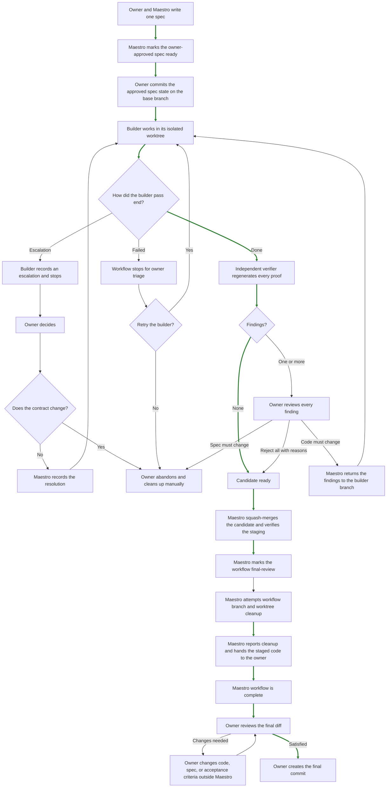

# Workflow

Maestro manages one spec driven development workflow in the current session.

The owner works with Maestro. Builder and verifier communicate with Maestro through repository handoffs. Maestro prepares the spec, manages Git resources, starts the builder and verifier, and records owner decisions.

## Roles

### Owner

The owner is the human in the loop. Every decision that needs human judgment returns to the owner.

The owner has final authority over:

- Requirements
- Scope
- Technical decisions recorded in the spec
- Escalation answers
- Finding decisions
- Spec approval
- Final review and final commit

### Maestro

Maestro:

- Discusses the change with the owner
- Writes and reviews the spec with the owner
- Creates workflow branches and worktrees
- Starts the builder and verifier
- Reads their handoffs
- Presents escalations and findings to the owner
- Records explicit owner decisions
- Prepares the accepted candidate for final review

### Builder

The builder works in an isolated worktree. It reads the spec, implements the approved change, and runs every acceptance criterion.

For each criterion, the builder runs the probe, applies the approved temporary breakage, confirms that the same probe fails, restores the implementation, and confirms that the probe passes again.

The builder ends a pass with one of these outcomes:

- `done`
- `failed`
- An escalation

### Verifier

The verifier starts with a fresh context in a separate worktree. It reads the spec and builder handoff. It regenerates every probe and breakage from the candidate commit.

The verifier records technical findings. It leaves product code unchanged when the pass ends.

Builder and verifier run in the foreground through pi-subagents delegation. Their agent definitions provide the role instructions; each task identifies the spec and worktree. While the pass runs, Maestro's Pi status shows the current phase and pi-subagents FleetView shows live activity and the transcript. The Maestro launch tool does not stream progress.

## Main flow

Happy path is highlighted in green.



## Workflow phases

Maestro stores the current phase in `.specs/<spec-id>/workflow.json` by default.

| Phase | Meaning |
|---|---|
| `drafting-spec` | Owner and Maestro are preparing the spec. |
| `ready-for-builder` | The owner approved the spec and it awaits a builder pass. |
| `builder-running` | A builder pass is active. |
| `escalation-decision` | The owner must decide how to resolve the active escalation. |
| `builder-failed` | The builder ended the pass with a failure. |
| `ready-for-verifier` | Builder work is ready for independent verification. |
| `verifier-running` | A verifier pass is active. |
| `findings-decision` | The owner must decide how to handle verifier findings. |
| `candidate-ready` | The candidate passed verification or all findings were rejected with reasons. |
| `final-review` | Maestro delivered staged changes and completed the workflow. |

A session can have one active Maestro workflow. Completed or abandoned workflows can remain under the spec directory.

A `builder-failed` workflow remains blocked. During the current session, the owner can explicitly retry with a clean worktree or abandon it manually.

## Spec approval

A spec defines one reversible change. It contains goals, constraints, requirements, technical design, relevant interactions or APIs, edge cases, acceptance criteria, observability, and scope limits.

Maestro reviews the spec with the owner but treats its Markdown as opaque workflow data. After the owner approves it, Maestro marks it ready without parsing its structure. The owner commits the spec with `workflow.json` on the base branch. That commit becomes the approved contract for the builder.

The base branch must be clean before Maestro starts the first builder pass.

## Acceptance criterion simplicity principle

Each acceptance criterion must prove exactly one thing.

```text
Probe
  How the behavior is verified.

Expected result
  What the probe must observe.

Breakage
  How to prove that the probe detects a broken behavior.
```

Each distinct error behavior required by the spec must have its own acceptance criterion. Equivalent inputs that produce the same behavior can share one criterion.
The breakage temporarily changes the implementation so the same probe must fail. Builder and verifier restore every breakage after the check.

### Example

```text
AC1: A failed upload removes its partial file

Probe
  Start a file upload, interrupt the connection, and inspect temporary storage.

Expected result
  No partial file remains.

Breakage
  Temporarily disable cleanup for interrupted uploads.
```

## Escalations

The builder opens an escalation when progress needs an owner decision. The escalation contains a question, context, options, consequences, next steps, and an optional recommendation.

The owner chooses one path:

- Continue with the current spec. Maestro records the answer and prepares another builder pass.
- Change the approved contract. The owner abandons the workflow manually and creates a new spec.

Each recorded escalation stays in the workflow history.

### Example

```text
Question
  Where should files be stored during an upload?

Context
  The application runs on multiple instances, and the spec does not select temporary storage.

Option A

Description
  Use the local temporary directory.

Consequences
  Each file stays on one application instance.

Next step
  Configure the upload flow to use the local temporary directory.

Option B

Description
  Use the existing object storage service.

Consequences
  Every application instance can access the file.

Next step
  Connect the upload flow to the existing object storage adapter.

Recommendation
  Choose Option B because it supports the current multi-instance setup.
```

## Findings

A finding records a technical issue found by the verifier. Every finding blocks progress until the owner makes a decision.

The owner chooses one action for each finding:

| Decision | Result |
|---|---|
| `reject` | Requires and records the owner’s reason. When every finding is rejected, the candidate becomes ready. |
| `fix-code` | Keeps the current spec and starts another builder cycle. |

When decisions are mixed, any `fix-code` decision starts another builder cycle. If the approved contract must change, the owner abandons the workflow manually and creates a new spec.

### Example

```text
Finding F1
  A failed upload leaves a partial file in temporary storage.

Evidence
  The interrupted-upload probe finds the partial file after the request ends.

Owner decision
  fix-code

Result
  The spec stays unchanged and Maestro starts another builder cycle.
```

## Final review

A candidate becomes ready after a verifier pass with no findings, or after the owner rejects every finding with a reason.

Maestro then:

1. Squash-merges the candidate onto the base branch.
2. Verifies the staged candidate.
3. Writes and stages `workflow.json` in `final-review`.
4. Attempts to remove the workflow branches and worktrees.
5. Reports any resource that requires manual cleanup.
6. Summarizes the candidate and hands the staged change to the owner.

`final-review` marks a completed Maestro workflow. The owner reviews the staged diff, makes any desired changes, and creates the final commit. Changes made after delivery are under the owner’s responsibility.

## Stored artifacts

Maestro creates the spec directory with `spec.md` and `workflow.json` when the owner creates a spec. It creates handoff, escalation, and prototype directories only when an action needs them. Git creates worktree directories when Maestro launches a builder or verifier.

The default spec directory contains:

```text
.specs/<spec-id>/
├── spec.md
├── workflow.json
├── handoffs/
│   ├── builder.json
│   ├── verifier.json
│   └── escalations/
│       ├── E1.json
│       └── ...
└── prototypes/
```
