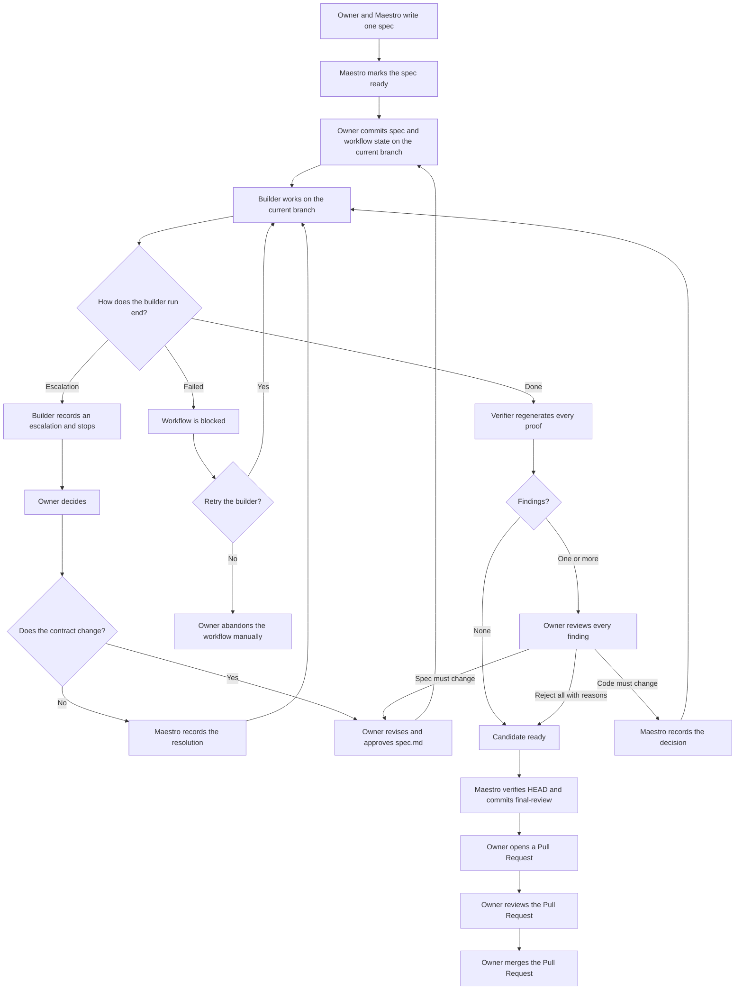

# Workflow

Maestro manages one spec-driven development workflow in the current session.

The owner works with Maestro. Builder and verifier communicate with Maestro through repository handoffs. Maestro prepares the spec, updates workflow state, starts the builder and verifier, and records owner decisions.

Maestro uses the current Git checkout and branch. It does not create, switch, name, or validate a branch. It does not create worktrees. If the owner starts on `main`, `master`, or another branch, all workflow commits use that branch.

## Roles

### Owner

The owner is the human in the loop. Every decision that needs human judgment returns to the owner.

The owner has final authority over:

- Requirements
- Scope
- Technical decisions recorded in the spec
- Escalation answers
- Finding decisions
- Spec approval
- Final Pull Request and merge

The owner does not change product code while the workflow is running. The owner may revise `spec.md` while the workflow is blocked, as described below.

### Maestro

Maestro:

- Discusses the change with the owner
- Writes and reviews the spec with the owner
- Creates workflow artifacts on the current branch
- Starts the builder and verifier
- Reads their handoffs
- Presents escalations and findings to the owner
- Records explicit owner decisions
- Prepares the current branch for a Pull Request

Maestro does not know or manage a target branch.

### Builder

The builder works on the current branch with a fresh context. It reads the active spec, implements the approved change, and runs every acceptance criterion.

For each criterion, the builder runs the probe, applies the approved temporary breakage, confirms that the same probe fails, restores the implementation, and confirms that the probe passes again.

The builder ends a run with one of these outcomes:

- `done`
- `failed`
- An escalation

The builder uses `maestro_record_builder_handoff` or `maestro_open_escalation`, then commits the implementation, generated workflow state, and handoff together.

### Verifier

The verifier works on the current branch with a fresh context. It reads the active spec and available artifacts. Historical artifacts provide context, not proof; the verifier decides which information is still applicable to the active spec.

The verifier independently regenerates every probe and breakage from the candidate. It does not repair product code and does not commit through Bash.

Before the verifier starts, Maestro commits a `verifier-running` checkpoint. The candidate is the parent of that checkpoint's `HEAD`.

The verifier applies and restores temporary breakages. `maestro_record_verifier_handoff` compares product files with that parent commit. If the product is unchanged, the tool writes `verifier.json` and `workflow.json` and commits only those protocol files. If product changes remain, the tool returns `PRODUCT_FILES_MODIFIED` and does not write or commit the handoff.

There is no numbered verifier pass and no separate verifier branch. The current artifact is always:

```text
.specs/<spec-id>/handoffs/verifier.json
```

Git preserves earlier verifier handoffs.

Builder and verifier runs are foreground operations. Pi waits for each run before the owner continues. Maestro's Pi status shows the current phase, and pi-subagents FleetView shows the live activity and transcript.

## Main flow



## Workflow phases

Maestro stores the current phase in `.specs/<spec-id>/workflow.json` by default.

| Phase | Meaning |
|---|---|
| `drafting-spec` | Owner and Maestro are preparing the initial spec. |
| `ready-for-builder` | The owner approved the spec and it awaits a builder run. |
| `builder-running` | A builder run is active. |
| `escalation-decision` | The owner must decide how to resolve the active escalation. |
| `builder-failed` | The builder ended the run with a failure. |
| `ready-for-verifier` | Builder work is ready for independent verification. |
| `verifier-running` | A verifier run is active. |
| `findings-decision` | The owner must decide how to handle verifier findings. |
| `candidate-ready` | The candidate passed verification or all findings were rejected with reasons. |
| `final-review` | Maestro verified the current candidate and completed the workflow. |

A session can have one active Maestro workflow. Completed or abandoned workflows can remain under the spec directory.

Disabling Maestro, restarting Pi, or using `/resume` clears live session state. Maestro does not resume an incomplete workflow from `workflow.json`; the owner must clean it up manually.

## Spec approval and revision

Maestro treats `spec.md` as opaque Markdown. It checks the workflow phase and file existence, but does not parse the spec or compare its content with an earlier version.

For the initial spec:

1. Maestro creates `spec.md` and `workflow.json` in `drafting-spec`.
2. The owner reviews and approves the spec.
3. `maestro_mark_spec_ready` changes the phase to `ready-for-builder`.
4. The owner commits `spec.md` and `workflow.json` on the current branch.

The commit is the approved contract for the builder.

A contract revision is allowed only from these blocked phases:

- `builder-failed`
- `escalation-decision`
- `findings-decision`

The owner edits and approves `spec.md`, then calls `maestro_mark_spec_ready` directly from the blocked phase. The tool changes the phase to `ready-for-builder`. There is no separate revision phase and no new `specId`.

The previous escalation or finding becomes inactive. Its artifact remains in the branch as historical context. Builder and verifier decide whether historical artifacts apply to the current spec.

The workflow does not store a separate spec version. The active contract is the current `spec.md`; Git preserves earlier versions and approvals.

Immediately before each builder launch, Maestro calculates the SHA-256 of the current `spec.md` and stores it only in live session state. Builder handoff and escalation tools compare the current file with that baseline. An explicit retry recalculates the baseline. A spec revision receives its new baseline only after the owner approves it. Restart, `/resume`, and deactivation discard the live baseline.

## Acceptance criterion simplicity principle

Each acceptance criterion must prove exactly one thing.

```text
Probe
  How the behavior is verified.

Expected result
  What the probe must observe.

Breakage
  How to prove that the probe detects a broken behavior.
```

Each distinct error behavior required by the spec must have its own acceptance criterion. Equivalent inputs that produce the same behavior can share one criterion.

Builder and verifier both run the probe, apply the specified safe breakage, run the same probe again, restore the breakage, and run the probe again. They must restore every temporary change before the handoff.

## Escalations

The builder opens an escalation when progress needs an owner decision. The escalation contains a question, context, options, consequences, next steps, and an optional recommendation.

The owner chooses one path:

- Continue with the current spec. Maestro records the answer and prepares another builder run.
- Change the approved contract. The owner revises `spec.md` from `escalation-decision`, calls `maestro_mark_spec_ready`, and prepares another builder run on the same branch and `specId`.

Each escalation remains in the workflow history. Older escalation artifacts are context only.

## Findings

A finding records a technical issue found by the verifier. Every finding blocks progress until the owner makes a decision.

| Decision | Result |
|---|---|
| `reject` | Requires and records the owner’s reason. When every finding is rejected, the candidate becomes ready. |
| `fix-code` | Keeps the current spec and starts another builder run. |
| Spec must change | The owner revises `spec.md` from `findings-decision`; previous findings become historical. |

When decisions are mixed, any `fix-code` decision starts another builder run. If the approved contract must change, the owner uses the same spec revision flow instead of resolving obsolete findings.

## Final review and Pull Request

A candidate becomes ready after a verifier run with no findings, or after the owner rejects every finding with a reason.

When the workflow is `candidate-ready`:

1. The current `HEAD` is the candidate.
2. The owner has not changed product code while the workflow was running.
3. Maestro verifies the current checkout and candidate state.
4. Maestro writes and commits `workflow.json` in `final-review` on the current branch.
5. Maestro returns the current branch and candidate facts to the owner.

Maestro does not squash, stage, merge, create, or remove branches. It does not create worktrees.

The owner opens the Pull Request from the current branch and chooses the merge method, including squash merge. After `final-review`, changes are outside the Maestro workflow and are not verified again by Maestro.

## Stored artifacts

Maestro creates the spec directory with `spec.md` and `workflow.json` when the owner creates a spec. It creates handoff, escalation, and prototype directories only when an action needs them.

The default spec directory contains:

```text
.specs/<spec-id>/
├── spec.md
├── workflow.json
├── handoffs/
│   ├── builder.json
│   ├── verifier.json
│   └── escalations/
│       ├── E1.json
│       └── ...
└── prototypes/
```

`builder.json` and `verifier.json` represent the current handoffs and can be overwritten by later runs. Escalations remain in the history directory. Earlier versions of all artifacts remain in Git commits.
