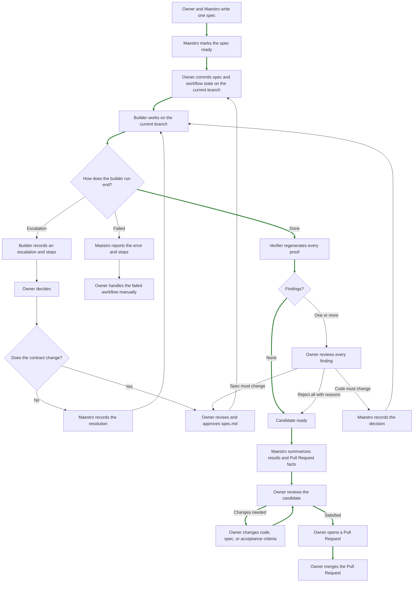

# Workflow

Maestro manages one spec-driven development workflow in the current session.

The approved `spec.md` is the contract between the owner, Maestro, the builder, and the verifier. 

It defines the intended behavior, constraints, technical decisions, and acceptance criteria. 

The owner works directly with Maestro. 

Maestro, using the current Git branch, prepares the spec, updates workflow state, starts the builder and verifier, and records owner decisions.

Builder and verifier communicate with Maestro through repository handoffs.

## Roles

### Owner

The owner is the human in the loop: every decision that needs human judgment returns to the owner.

The owner has final authority over:

- Requirements
- Scope
- Technical decisions recorded in the spec
- Escalation answers
- Finding decisions
- Spec approval
- Git flow after the candidate is ready
- Final Pull Request and merge

### Maestro

- Discusses the change with the owner
- Writes and reviews the spec with the owner
- Creates workflow artifacts on the current branch
- Starts the builder and verifier
- Reads their handoffs
- Presents escalations and findings to the owner
- Records explicit owner decisions
- Summarizes the results and facts for a Pull Request when the candidate is ready

### Builder

The builder works on the current branch with a fresh context. 

It reads the active spec, implements the approved change, and runs every acceptance criterion.

For each criterion, the builder runs the probe, applies the approved temporary breakage, confirms that the same probe fails, restores the implementation, and confirms that the probe passes again.

The builder ends a run with one of these outcomes:

- `done`
- `failed`
- An `escalation`

### Verifier

The verifier works on the current branch with a fresh context. 

It reads the active spec and available artifacts. Historical artifacts provide context, not proof.

Before the verifier starts, Maestro commits a `verifier-running` checkpoint. That checkpoint is the candidate commit. Its commit ID stays fixed for the entire verifier run.

The verifier never changes product code, it independently regenerates every probe and breakage from the candidate.


The verifier applies and restores temporary breakages. `maestro_record_verifier_handoff` compares product files with that checkpoint commit. If the product is unchanged, the tool writes `verifier.json` and `workflow.json` and commits only those protocol files. If product changes remain, the tool returns `PRODUCT_FILES_MODIFIED` and does not write or commit the handoff.

There is no numbered verifier pass and no separate verifier branch. The current artifact is always:

```text
.specs/<spec-id>/handoffs/verifier.json
```

Git preserves earlier verifier handoffs.

Builder and verifier runs are foreground operations. Pi waits for each run before the owner continues. Maestro's Pi status shows the current phase, and pi-subagents FleetView shows the live activity and transcript.

## Main flow

Happy path is highlighted in green.


```mermaid
flowchart TD
    spec[Owner and Maestro write one spec]
    ready[Maestro marks the spec ready]
    approval[Owner commits spec and workflow state on the current branch]
    build[Builder works on the current branch]
    buildOutcome{How does the builder run end?}

    spec --> ready
    ready --> approval
    approval --> build
    build --> buildOutcome

    buildOutcome -->|Escalation| escalation[Builder records an escalation and stops]
    escalation --> ownerAnswer[Owner decides]
    ownerAnswer --> escalationOutcome{Does the contract change?}
    escalationOutcome -->|No| recordContinue[Maestro records the resolution]
    recordContinue --> build
    escalationOutcome -->|Yes| reviseSpec[Owner revises and approves spec.md]
    reviseSpec --> approval

    buildOutcome -->|Failed| builderFailed[Maestro reports the error and stops]
    builderFailed --> abandoned[Owner handles the failed workflow manually]

    buildOutcome -->|Done| verify[Verifier regenerates every proof]
    verify --> findings{Findings?}

    findings -->|None| candidate[Candidate ready]
    findings -->|One or more| ownerFindings[Owner reviews every finding]

    ownerFindings -->|Reject all with reasons| candidate
    ownerFindings -->|Code must change| returnBuilder[Maestro records the decision]
    returnBuilder --> build
    ownerFindings -->|Spec must change| reviseSpec

    candidate --> summary[Maestro summarizes results and Pull Request facts]
    summary --> ownerReview[Owner reviews the candidate]
    ownerReview -->|Changes needed| adjust[Owner changes code, spec, or acceptance criteria]
    adjust --> ownerReview
    ownerReview -->|Satisfied| pullRequest[Owner opens a Pull Request]
    pullRequest --> merge[Owner merges the Pull Request]

    linkStyle 0,1,2,3,13,14,15,21,22,23,24,25,26 stroke:#2e7d32,stroke-width:3px
```

## Workflow phases

Maestro stores the current phase in `.specs/<spec-id>/workflow.json` by default.

| Phase | Meaning |
|---|---|
| `drafting-spec` | Owner and Maestro are preparing the initial spec. |
| `ready-for-builder` | The owner approved the spec and it awaits a builder run. |
| `builder-running` | A builder run is active. |
| `escalation-decision` | The owner must decide how to resolve the active escalation. |
| `builder-failed` | The builder ended the run with a failure. |
| `ready-for-verifier` | Builder work is ready for independent verification. |
| `verifier-running` | A verifier run is active. |
| `findings-decision` | The owner must decide how to handle verifier findings. |
| `candidate-ready` | The candidate passed verification or all findings were rejected with reasons. This is the last persisted Maestro phase. |

A session can have one active Maestro workflow. A workflow in `candidate-ready` is complete from Maestro's point of view. Completed or abandoned workflows can remain under the spec directory.

Disabling Maestro, restarting Pi, or using `/resume` clears live session state. Maestro does not resume an incomplete workflow from `workflow.json`; the owner must clean it up manually.

## Spec approval and revision

Maestro treats `spec.md` as opaque Markdown. It checks the workflow phase and file existence, but does not parse the spec or compare its content with an earlier version.

For the initial spec:

1. Maestro creates `spec.md` and `workflow.json` in `drafting-spec`.
2. The owner reviews and approves the spec.
3. `maestro_mark_spec_ready` changes the phase to `ready-for-builder`.
4. The owner commits `spec.md` and `workflow.json` on the current branch.

The committed `spec.md` and `workflow.json` are the approved contract for the builder and verifier. The contract is immutable during a builder or verifier pass. When a discovery shows that the contract must change, the owner makes an explicit revision and approval before the next pass.

A contract revision is allowed only from these blocked phases:

- `escalation-decision`
- `findings-decision`

`builder-failed` is a sink state. Maestro reports the technical error and stops the workflow; it does not retry the builder or revise the spec from that state.

The owner edits and approves `spec.md`, then calls `maestro_mark_spec_ready` directly from the blocked phase. The tool changes the phase to `ready-for-builder`. There is no separate revision phase and no new `specId`.

The previous escalation or finding becomes inactive. Its artifact remains in the branch as historical context. Builder and verifier decide whether historical artifacts apply to the current spec.

The workflow does not store a separate spec version. The active contract is the current `spec.md`; Git preserves earlier versions and approvals.

Immediately before each builder run, Maestro calculates the SHA-256 of the current `spec.md` and stores it only in live session state. Builder handoff and escalation tools compare the current file with that baseline. A spec revision receives its new baseline only after the owner approves it. Restart, `/resume`, and deactivation discard the live baseline.

## Acceptance criterion simplicity principle

Each acceptance criterion must prove exactly one thing.

```text
Probe
  How the behavior is verified.

Expected result
  What the probe must observe.

Breakage
  How to prove that the probe detects a broken behavior.
```

Each distinct error behavior required by the spec must have its own acceptance criterion. Equivalent inputs that produce the same behavior can share one criterion.

Builder and verifier both run the probe, apply the specified safe breakage, run the same probe again, restore the breakage, and run the probe again. They must restore every temporary change before the handoff.

## Escalations

An escalation is the way Maestro brings a significant implementation discovery to the owner's attention and asks for a decision. It is not necessarily a technical failure, an error, or a blocker.

An escalation is relevant when the work presents meaningful alternatives with different consequences. Examples include a conflict between the approved contract and the repository, behavior that the contract does not define, a material architectural alternative, a possible scope change, or a decision that affects verification or reversibility.

Each escalation presents a question, context and evidence, available options, consequences, next steps, and an optional recommendation. While an escalation is unresolved, the workflow is paused in `escalation-decision` and the owner must decide how to proceed.

The owner can choose one of two paths:

- Continue with the current contract. Maestro records the decision and returns the workflow to `ready-for-builder` for another builder run.
- Change the approved contract. The owner revises and approves `spec.md`, then calls `maestro_mark_spec_ready`. The workflow returns to `ready-for-builder` on the same branch and with the same `specId`.

Each escalation remains in the workflow history as references.

## Findings

A finding records a technical issue found by the verifier. Every finding blocks progress until the owner makes a decision.

| Decision | Result |
|---|---|
| `reject` | Requires and records the owner’s reason. When every finding is rejected, the candidate becomes ready. |
| `fix-code` | Keeps the current spec and returns the workflow to `ready-for-builder`. |
| Spec must change | The owner revises `spec.md` from `findings-decision`; previous findings become historical. |

When decisions are mixed, any `fix-code` decision returns the workflow to `ready-for-builder`. Run the builder separately. If the approved contract must change, the owner uses the same spec revision flow instead of resolving obsolete findings.

## Completion and Pull Request

The workflow ends at `candidate-ready` after a verifier run with no findings, or after the owner rejects every finding with a reason.

The operations that produce this phase, `maestro_record_verifier_handoff` and `maestro_resolve_findings`, own the required checks:

1. Before writing the transition, they make sure that the resulting handoff matches the spec identity and workflow revision, with no active findings.
2. They reject changes outside the expected protocol files. The verifier must also restore the product to the verified candidate.
3. They commit only the expected protocol files and return success only when the checkout is clean.

No final tool call or checkpoint is needed. `candidate-ready` is the last persisted Maestro phase.

Maestro reads the artifacts and Git information to summarize the changes, verification results, rejected findings and reasons, and applicable builder notes. The summary includes the current branch and final `HEAD`. Rejected findings are owner decisions, not proof that verification passed.

The summary does not change files or workflow state, create commits, or run verification again. The owner controls the Git flow, review, Pull Request, and merge. Maestro does not squash, stage, merge, create, or remove branches. It does not create worktrees.

## Stored artifacts

When the owner creates a spec, Maestro creates the spec directory with `spec.md` and `workflow.json`. It also creates the empty `handoffs/escalations/` and `prototypes/` directories. Later workflow actions create the artifact files.

The default spec directory contains:

```text
.specs/<spec-id>/
├── spec.md
├── workflow.json
├── handoffs/
│   ├── builder.json
│   ├── verifier.json
│   └── escalations/
│       ├── E1.json
│       └── ...
└── prototypes/
```

- `builder.json` and `verifier.json` represent the current handoffs and can be overwritten by later runs. 
- Builder handoff `notes` contain curated significant discoveries that did not require an owner decision; Maestro surfaces the applicable notes in the final workflow summary. 
- Escalations remain in the history directory. 
- Earlier versions of all artifacts remain in Git commits.
