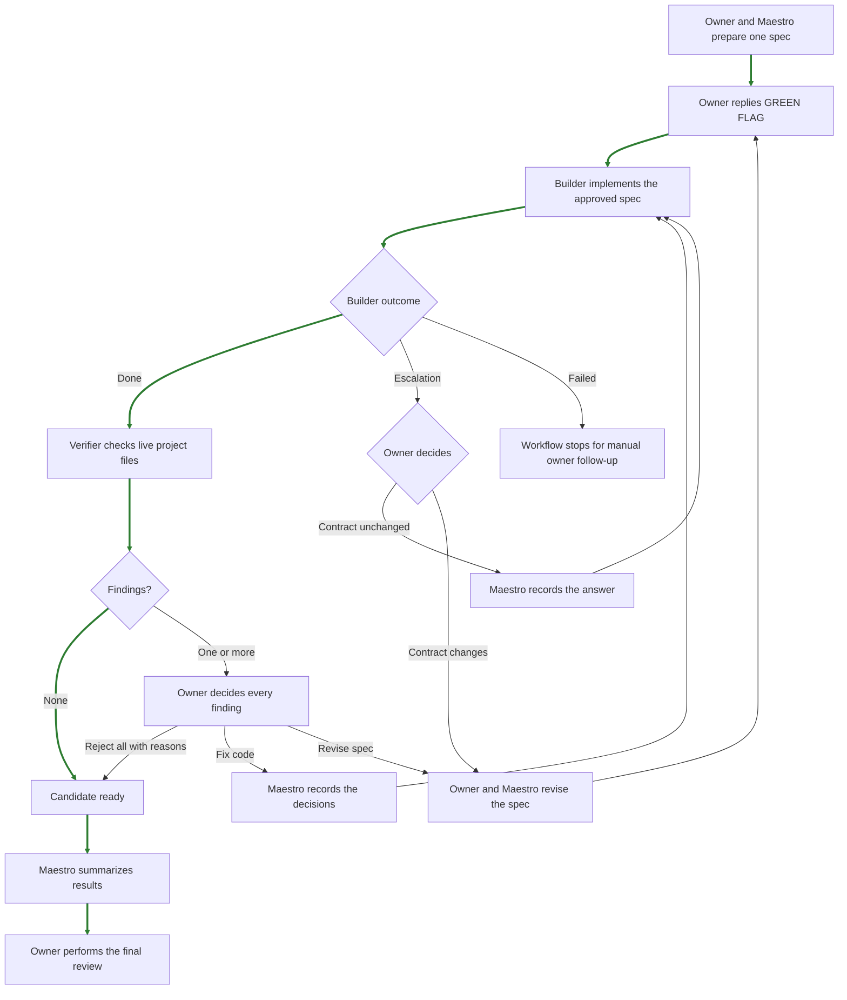

# Workflow

Maestro manages one spec-driven workflow in the current Pi session. The owner works directly with Maestro.

The approved `spec.md` is the contract for the change. It defines behavior, scope, constraints, technical decisions, and acceptance criteria.

An acceptance criterion contains a probe, an expected result and an example. The probe checks an acceptance criterion against its expected result. 

An agent run result is a handoff.
The handoff can contain:
- Escalations: the owner have to decide implementation questions.
- Findings: technical issues on the implementation
- Evidences: work executed by agents

The workflow uses files in the [project root](configuration.md#project-root).

## Roles

| Role | Responsibility |
|---|---|
| Owner | Decides requirements, scope, technical decisions, spec approval, escalation answers, and finding decisions. Performs the final review. |
| Maestro | Prepares the spec with the owner, records workflow progress, runs agents, presents issues, and saves owner decisions. |
| Builder | Implements the approved spec and runs every probe. Reports completion, an escalation, or a technical failure. |
| Verifier | Independently runs every probe against the live project files. Reports findings without repairing product code. |

Builder and verifier runs are sequential foreground operations. Each starts with a fresh conversation and reads the spec and saved artifacts.

Maestro's Pi status shows the current phase. `pi-subagents` FleetView and `/subagents-fleet` show live agent activity and transcripts.

## Main flow

The green arrows and lines show the path without escalations or findings.


```mermaid
flowchart TD
    spec[Owner and Maestro prepare one spec]
    approval[Owner replies GREEN FLAG]
    build[Builder implements the approved spec]
    buildOutcome{Builder outcome}
    verify[Verifier checks live project files]
    findings{Findings?}
    candidate[Candidate ready]
    summary[Maestro summarizes results]
    review[Owner performs the final review]

    spec --> approval
    approval --> build
    build --> buildOutcome
    buildOutcome -->|Done| verify
    verify --> findings
    findings -->|None| candidate

    buildOutcome -->|Escalation| ownerEscalation{Owner decides}
    ownerEscalation -->|Contract unchanged| recordEscalation[Maestro records the answer]
    recordEscalation --> build
    ownerEscalation -->|Contract changes| reviseSpec[Owner and Maestro revise the spec]
    reviseSpec --> approval

    buildOutcome -->|Failed| stopped[Workflow stops for manual owner follow-up]

    findings -->|One or more| ownerFindings[Owner decides every finding]
    ownerFindings -->|Reject all with reasons| candidate
    ownerFindings -->|Fix code| recordFixes[Maestro records the decisions]
    recordFixes --> build
    ownerFindings -->|Revise spec| reviseSpec

    candidate --> summary
    summary --> review

    linkStyle 0,1,2,3,4,5,17,18 stroke:#2e7d32,stroke-width:3px
```

## Workflow phases

Each spec has a `workflow.json` file that records its identity and current phase. The saved phase controls the next permitted workflow action. An agent's final message alone does not establish a completed action.

The default path is `.specs/<spec-id>/workflow.json`. The spec directory is [configurable](configuration.md).

| Phase | Meaning |
|---|---|
| `drafting-spec` | The owner and Maestro are preparing the initial spec. |
| `ready-for-builder` | The approved spec or recorded owner decisions permit a builder run. |
| `builder-running` | A builder run is active. |
| `escalation-decision` | The owner must decide how to handle the current escalation. |
| `builder-failed` | The builder recorded a technical failure. The workflow stops. |
| `ready-for-verifier` | The builder completed the work and the verifier can start. |
| `verifier-running` | A verifier run is active. |
| `findings-decision` | The owner must decide how to handle every current finding. |
| `candidate-ready` | The verifier reported no findings, or the owner rejected every finding with a reason. The workflow is complete. |

## Spec approval

For the initial spec:

1. Maestro creates `spec.md` and `workflow.json` in `drafting-spec` and prepares the spec with the owner.
2. The owner reviews the requirements, scope, technical decisions, and acceptance criteria.
3. Maestro asks the owner to inspect the current `spec.md` and reply `GREEN FLAG` to approve it and start the builder.
4. After that reply, Maestro saves `ready-for-builder` and starts the builder in the foreground.

Approval freezes the spec as the contract. The spec and its visual prototypes remain unchanged during builder and verifier execution. Contract revisions are limited to the decision phases described in [Spec revision](#spec-revision).

## Acceptance criteria

Each acceptance criterion has a unique ID and describes one observable result. It contains these parts:

| Part | Content |
|---|---|
| Probe | Starting conditions and the action or observation that checks the behavior. |
| Expected result | The measurable result the probe observes. |
| Example | Concrete starting conditions, an input or action, and the exact expected result. |

## Escalations

An escalation returns an implementation decision to the owner. It does not necessarily mean that a technical failure occurred. Examples include undefined behavior, a conflict with the spec, or a possible scope change.

Maestro presents the question, evidence, options, consequences, and next steps. The workflow pauses in `escalation-decision` until the owner decides.

| Owner choice | Result |
|---|---|
| Keep the current contract | Maestro records the answer and reason, returns to `ready-for-builder`, and starts another builder run. |
| Change the contract | The owner and Maestro revise the same spec and obtain renewed approval before another builder run. |

The escalation file remains available as history.

## Findings

Every current finding requires an owner decision, regardless of severity. Maestro explains the issue, evidence, practical effect, and available choices.

| Decision | Result |
|---|---|
| `reject` | Records the owner's reason. If every finding is rejected, the workflow reaches `candidate-ready`. |
| `fix-code` | Keeps the current spec and returns to `ready-for-builder` for code fixes. |

Any `fix-code` decision requires another builder run, including when other findings are rejected. After the builder completes the fixes, the verifier checks the work again.

If the contract must change, the owner and Maestro use [Spec revision](#spec-revision) instead. Earlier findings then become historical context.

## Spec revision

Contract revisions are allowed only in `escalation-decision` or `findings-decision`. Maestro revises the same spec with the owner, including its prototypes when needed.

After review and cleanup, Maestro asks the owner to inspect the revised spec and reply `GREEN FLAG` again. Maestro then records `ready-for-builder` and starts another builder run.

Previous escalations, findings, and handoffs remain as historical context. The revised spec is the contract for subsequent work.

## Verification boundary

The verifier can make temporary changes for probes. Before submitting its handoff, it restores the exact original contents of affected files and removes only files it created.

Cleanup relies on the verifier. If cleanup cannot finish safely, the verifier stops and reports the remaining changes.

## Workflow completion

The workflow ends at `candidate-ready`. Maestro summarizes the changes, verification results, rejected findings and reasons, and relevant builder notes from the saved artifacts.

The owner performs the final review and controls any later Git use, pull request, or merge. Changes after completion are outside the completed verification.

## Stored artifacts

Maestro creates the spec directory with `spec.md`, `workflow.json`, and empty `handoffs/escalations/` and `prototypes/` directories. Builder and verifier handoff directories appear when those results are saved.

The default layout after multiple runs is:

```text
.specs/<spec-id>/
├── spec.md
├── workflow.json
├── handoffs/
│   ├── builder/
│   │   ├── B1.json
│   │   └── B2.json
│   ├── verifier/
│   │   ├── V1.json
│   │   └── V2.json
│   └── escalations/
│       ├── E1.json
│       └── ...
└── prototypes/
```

Each new handoff gets the next number in its role's sequence. Maestro uses the latest handoff in each sequence as the active result, and earlier handoffs remain on the file system as references.

## Limitations

Maestro provides no automatic rollback, repair, or recovery for failed or interrupted workflows. The files that remain are available for owner inspection. The owner handles the workflow manually.

Disabling Maestro, restarting Pi, or using `/resume` clears live Maestro session state and leaves project files unchanged. Maestro starts disabled in a new or resumed session. Reactivating it does not reconstruct or resume a saved workflow.
