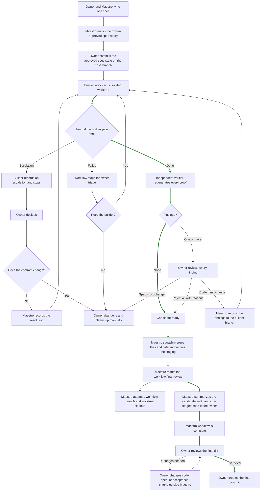

Questo piano nasce dal workflow legacy in `../my-weather-station`, che resta intatto e viene usato solo come riferimento. L’implementazione riguarda il repository `pi-maestro`.

<a id="plan-section-1"></a>

# 1. Obiettivo

Creare un pacchetto Pi chiamato **Maestro**.

Il pacchetto attiva, su comando dell’owner, un workflow con questi ruoli:

```text
Owner ↔ Maestro ↔ Builder / Verifier
```

L’owner conversa solo con il maestro.

Il maestro:

1. Prepara la spec con l’owner.
2. Gestisce branch e worktree.
3. Avvia builder e verifier tramite `pi-subagents`.
4. Legge gli handoff.
5. Riporta escalation e finding all’owner.
6. Registra le decisioni dell’owner.
7. Porta il candidate commit sulla base branch.
8. Non decide requisiti o scelte di prodotto al posto dell’owner.

L’estensione nasce da un workflow implementato e usato nel repository `my-weather-station`. `AGENTS_CONTRIBUTING.md`, `CONTRIBUTING.md`, gli script e i template sono stati copiati da lì in questa directory. Servono come riferimento per la documentazione e lo sviluppo dell’estensione.

L’intero workflow è progettato per mantenere sempre lo human-in-the-loop.

<a id="plan-section-2"></a>

# 2. Decisioni definitive

<a id="plan-section-2-1"></a>

## 2.1 Pi Subagents

Useremo `pi-subagents`.

Builder e verifier saranno agent distribuiti dal pacchetto Maestro.

Il package li dichiara così:

```json
{
  "pi": {
    "extensions": ["./extensions/maestro.ts"],
    "subagents": {
      "agents": ["./agents"]
    }
  }
}
```

<a id="plan-section-2-2"></a>

## 2.2 Confine dell’estensione

Maestro contiene solo il workflow generico.

Non contiene regole di build o conoscenze specifiche di un repository.

Il pacchetto gestisce:

1. Il ruolo maestro.
2. Il protocollo owner, maestro, builder e verifier.
3. La creazione delle spec.
4. Il template della spec.
5. Gli handoff.
6. Le escalation.
7. I finding.
8. Branch e worktree.
9. Il ciclo builder e verifier.
10. Il candidate commit.
11. La review finale dell’owner.
12. La pulizia finale.
13. La persistenza del workflow nel repository.

<a id="plan-section-2-3"></a>

## 2.3 Responsabilità del repository

Gli `AGENTS.md` restano nel repository.

Il developer del repository è responsabile di dichiarare lì:

1. Installazione delle dipendenze.
2. Lint.
3. Build.
4. Test.
5. Migration.
6. Screenshot.
7. Viewport.
8. Hook.
9. Vincoli tecnici.
10. Qualsiasi strumento necessario per lavorare e verificare.

Builder e verifier leggono gli `AGENTS.md` applicabili.

Se una regola o un comando è presente, lo eseguono.

Se non è presente, Maestro non lo inventa e non lo rende obbligatorio.

<a id="plan-section-2-4"></a>

## 2.4 Cose escluse da Maestro

Queste cose non fanno parte dell’estensione:

1. `npm ci`
2. `npm run lint`
3. `npm run build`
4. `.githooks/pre-commit`
5. Regole sulle migration
6. Risoluzioni concrete per gli screenshot
7. Comandi Playwright
8. Strumenti di test specifici
9. Regole di workspace specifiche
10. Dipendenze del prodotto

L’estensione Maestro non definisce né esegue autonomamente comandi di installazione. Builder e verifier li eseguono solo quando sono dichiarati negli `AGENTS.md` applicabili.

<a id="plan-section-2-5"></a>

## 2.5 Directory delle spec

La directory delle spec è configurabile.

Default:

```text
.specs
```

Esempio alternativo:

```json
{
  "specDirectory": ".my-super-special-specs-folder"
}
```

Gli artefatti prodotti usano questa struttura:

```text
.specs/<id>/
├── spec.md
├── workflow.json
├── handoffs/
│   ├── builder.json
│   ├── verifier.json
│   └── escalations/
│       ├── E1.json
│       ├── E2.json
│       └── ...
└── prototypes/
```

`builder.json` e `verifier.json` contengono l’evidenza dell’handoff corrente e possono essere sostituiti da un passaggio successivo. Git conserva le versioni precedenti. Le escalation costituiscono la storia durevole delle decisioni builder.

<a id="plan-section-2-6"></a>

## 2.6 Directory dei worktree

La directory dei worktree è configurabile.

Default:

```text
.worktree
```

Maestro gestisce la creazione e la rimozione dei worktree usati dal workflow.

<a id="plan-section-2-7"></a>

## 2.7 Nessun comando di inizializzazione

Non esisterà `/maestro-init`.

L’avvio di Pi non esegue controlli Maestro e non mostra notifiche Maestro.

Il controllo dell’ambiente viene eseguito quando l’owner usa `/maestro` per attivare o riattivare la modalità. Dopo `/resume`, Maestro resta inattivo finché l’owner non usa nuovamente `/maestro`.

Il controllo non deve modificare il repository. Se fallisce, Maestro resta disattivato e Pi continua a funzionare normalmente.

L’assenza di `.specs` è valida. Significa che non esistono ancora spec.

L’assenza di `.worktree` è valida. La directory viene creata quando serve.

<a id="plan-section-2-8"></a>

## 2.8 Template e generazione degli artefatti

I vecchi template JSON e gli script copiati dal workflow legacy sono solo materiale di riferimento e non entrano nel pacchetto.

Il pacchetto distribuisce un solo template:

```text
templates/spec.md
```

Gli artefatti JSON vengono costruiti da oggetti TypeScript tipizzati e validati dai relativi schemi. Generazione degli ID, numerazione delle escalation, scrittura e validazione degli handoff vengono gestite dai tool Pi dell’estensione principale e child-only. Non vengono esposti script Node eseguibili direttamente e non viene copiata infrastruttura permanente nel repository.

<a id="plan-section-2-9"></a>

## 2.9 Configurazione dei modelli

Builder e verifier hanno modelli configurabili in `.pi/maestro.json`.

Default approvati:

```text
Builder:
  model: openai-codex/gpt-5.6-luna
  thinking: high

Verifier:
  model: openai-codex/gpt-5.6-sol
  thinking: medium
```

Lo schema completo e i vincoli di validazione sono definiti nella sezione 6.6.

<a id="plan-section-2-10"></a>

## 2.10 Regole visuali

Resta nel pacchetto la regola generica:

> Una dichiarazione visuale deve essere verificabile.

Il pacchetto può mantenere il concetto di:

1. Prototipo per una nuova superficie visuale.
2. Probe programmatico per una superficie esistente.
3. Confronto tra prototipo e applicazione quando richiesto dalla spec.

Non fanno parte del pacchetto:

1. Le risoluzioni.
2. Il browser.
3. Il framework E2E.
4. I comandi di screenshot.
5. Il percorso di avvio dell’applicazione.

Queste informazioni arrivano dagli `AGENTS.md` o dalla spec.

<a id="plan-section-2-11"></a>

## 2.11 Stato persistente

Il repository resta la fonte autorevole.

La conversazione del subagent non è un handoff.

Le fonti autorevoli sono:

1. Spec e `workflow.json`.
2. Escalation come storia durevole delle decisioni builder.
3. Builder e verifier handoff come artefatti correnti del ciclo attivo.
4. Commit, branch e worktree Git.

Lo stato in memoria dell’estensione può servire alla UI, ma non deve essere l’unica copia dello stato del workflow.

<a id="plan-section-3"></a>

# 3. Regole generiche che passano nel pacchetto

Queste regole oggi presenti in `AGENTS_CONTRIBUTING.md` sono generiche e appartengono a Maestro.

<a id="plan-section-3-1"></a>

## 3.1 Autorità

1. L’owner decide requisiti, scope, escalation e finding.
2. Il maestro coordina.
3. Builder e verifier non parlano direttamente con l’owner.
4. Builder e verifier non decidono al posto dell’owner.
5. Il maestro non inventa lavoro.

<a id="plan-section-3-2"></a>

## 3.2 Spec

1. Una spec descrive una modifica reversibile.
2. Non contiene una allowlist preventiva dei file modificabili.
3. Il builder non può cambiare unilateralmente il contratto della spec.
4. Una spec incompleta o impossibile blocca il lancio.
5. Placeholder non sostituiti bloccano `ready-for-builder`.
6. Tutte le quattro sezioni principali restano sempre presenti con numerazione stabile.
7. Le sottosezioni `Prototype and user interaction`, `API specification` e `Monitoring and observability` contengono `Not applicable.` quando non applicabili.
8. Le altre sottosezioni dichiarano esplicitamente quando non esistono elementi specifici.
9. Ogni edge case o comportamento di errore richiesto deve essere coperto da un acceptance criterion.
10. Sottosezioni aggiuntive sono consentite, ma non sostituiscono quelle obbligatorie.

Template approvato:

````md
# <id>: <short, outcome-oriented title>

## 1. Context, goals, and scope

<Describe the current situation, who or what is affected, and the problem or opportunity without describing the implementation.>

### Measurable goals

- <Observable outcome that must become possible.>
- <Metric or verifiable condition that defines success.>

### Out of scope

- <Related behavior, integration, migration, or component that must not be implemented.>
- <Existing behavior that remains unchanged and is not being redesigned.>

Write `No additional out-of-scope items.` when none are known.

## 2. Requirements and constraints

### Functional requirements

- <Behavior the system must provide.>
- <Actor or system action and its required outcome.>

Write `No new functional behavior.` when the change is purely technical.

### Non-functional requirements

- <Measurable performance, reliability, security, accessibility, privacy, or compatibility requirement.>

Write `No additional non-functional requirements.` when none apply.

### Constraints

- <Non-negotiable technical, business, legal, security, operational, or compatibility boundary.>
- <Existing behavior or contract that must remain unchanged.>

Write `No additional constraints.` when none are known.

### Edge cases and error handling

| Case | Expected behavior | State and recovery |
|---|---|---|
| <Boundary or error condition> | <Observable system behavior> | <Preserved state, rollback, retry, or recovery behavior> |
| <Unavailable dependency> | <Error presented to the caller or user> | <Partial state handling and retry behavior> |
| <Repeated or concurrent operation> | <Idempotent, serialized, or conflict behavior> | <Resulting authoritative state> |

Every required edge case must be covered by an acceptance criterion.

Write `No additional edge cases.` only when none apply.

## 3. Technical design

<Describe the approved technical decisions that affect the repository architecture. Do not list every file or local implementation detail.>

Include only relevant optional subsections. Write `No architectural changes. Follow the existing repository patterns.` when none apply.

### Components and data flow

<Describe affected components, responsibilities, data models, state changes, and important boundaries.>

### API specification

Write `Not applicable.` when no API contract changes.

For each operation, define the protocol and operation, caller permissions, input, successful output, errors and side effects, and delivery or consistency rules.

### Prototype and user interaction

Write `Not applicable.` when there is no visual or interactive behavior.

- `prototypes/<surface-name>.<html|png|jpg|jpeg>`: <surface and states represented by the prototype>

<Describe user triggers, state transitions, validation, feedback, accessibility, and recovery behavior.>

### External integrations

<Describe affected services, SDKs, events, queues, webhooks, failure boundaries, and retry behavior.>

### Security and privacy

<Describe authentication, authorization, trust boundaries, sensitive-data handling, retention, encryption, and redaction.>

### Compatibility and migration

<Describe backward compatibility, migration, rollout, rollback, and coexistence with older versions.>

### Monitoring and observability

Write `Not applicable.` when no operational signal changes.

<Describe required signals, triggers, diagnostic information, alerts, thresholds, ownership, and sensitive data that must not be recorded.>

## 4. Acceptance criteria

### AC1: <short observable claim>

- **Probe**: <exact command, API call, or reproducible procedure>
- **Expected result**: <observable and measurable result>
- **Breakage**: <specific temporary implementation change that must make the probe fail>
````

Regole per `Context, goals, and scope`:

1. Descrive brevemente situazione attuale, soggetti coinvolti e problema oppure opportunità.
2. Spiega il valore per utenti, business o sistema senza anticipare l’implementazione.
3. Ogni goal è osservabile o misurabile e descrive un risultato, non un’attività.
4. Ogni goal è coperto da almeno un acceptance criterion.

Regole per `Constraints`:

1. Contiene solo limiti non negoziabili che restringono le soluzioni possibili.
2. Non contiene funzionalità da costruire o preferenze deboli.
3. Maestro non inventa constraint.
4. Un comportamento esistente da preservare viene indicato in modo preciso.
5. I constraint verificabili sono coperti dagli acceptance criteria.
6. Se il builder scopre che un constraint non può essere rispettato, apre un’escalation.
7. Quando non esistono constraint aggiuntivi, la sezione contiene `No additional constraints.`.

Regole per `Requirements`:

1. Ogni requirement descrive un risultato specifico e verificabile.
2. I functional requirements descrivono comportamento, input, stato e risultato senza imporre dettagli di implementazione.
3. I non-functional requirements descrivono qualità misurabili; termini vaghi non sono sufficienti.
4. Ogni requirement è coperto da almeno un acceptance criterion.
5. Errori e boundary case dettagliati restano in `Edge cases and error handling`.
6. Requirements e acceptance criteria non possono contraddirsi.
7. Maestro non inventa requisiti mancanti.
8. Una modifica puramente tecnica usa `No new functional behavior.` quando appropriato.

Regole per `Technical design`:

1. Contiene solo decisioni con impatto tecnico o architetturale e non è una allowlist dei file.
2. Non tenta di prevedere ogni classe, funzione o dettaglio locale.
3. Le decisioni approvate sono vincolanti; il builder resta libero sui dettagli non specificati.
4. Una deviazione architetturale richiede un’escalation.
5. Le sottosezioni non applicabili vengono rimosse.
6. Quando non esistono decisioni architetturali, la sezione contiene `No architectural changes. Follow the existing repository patterns.`.
7. Nuove dipendenze, migrazioni e integrazioni sono dichiarate esplicitamente.
8. Diagrammi Mermaid sono consentiti quando chiariscono flussi o confini.
9. Il design deve essere coerente con constraints e requirements e non contiene acceptance criteria o output di test.

Regole per `Prototype and user interaction`:

1. Una nuova superficie visuale senza riferimento esistente richiede almeno un prototipo `.html`, `.png`, `.jpg` o `.jpeg` sotto `.specs/<id>/prototypes/`.
2. Una modifica limitata a una superficie esistente può omettere la sottosezione `Prototype`, ma il risultato visuale deve essere coperto dagli acceptance criteria.
3. Il prototipo è un riferimento di design, non codice di produzione.
4. Un prototipo HTML è standalone e può includere CSS e JavaScript locali nello stesso file, ma non richiede build, server, dipendenze o rete. Un prototipo immagine è statico e usa un’estensione lowercase approvata.
5. Mostra gli stati rilevanti e la descrizione copre trigger, transizioni, feedback e recupero dagli errori.
6. Accessibilità, keyboard behavior e responsive behavior vengono specificati quando rilevanti.
7. Risoluzioni, browser e strumenti specifici arrivano dagli `AGENTS.md` o dalla spec.
8. Il prototipo viene approvato e committato insieme alla spec.
9. Un conflitto tra prototipo, requirements e acceptance criteria blocca `ready-for-builder`.

Regole per `API specification`:

1. La sottosezione contiene `Not applicable.` quando non introduce o modifica un contratto API.
2. Ogni operazione ha un nome univoco e identifica esattamente metodo, path, procedure, topic o evento.
3. Input e output indicano campi, tipi, obbligatorietà e vincoli; gli esempi validi non sostituiscono la definizione del contratto.
4. Authentication identifica il caller; authorization definisce cosa può fare.
5. Ogni errore definisce condizione, codice ed effetto osservabile, senza formule vaghe.
6. Side effect e assenza di side effect sono espliciti.
7. Idempotency, retry, ordering, pagination, rate limit e consistency vengono descritti quando applicabili.
8. Eventi e webhook specificano producer, consumer, payload, delivery, retry e ordering.
9. Gli schemi autorevoli già presenti nel repository vengono aggiornati; la spec non li sostituisce.
10. Compatibility e versioning restano coerenti con `Technical design`.
11. Errori e contratti significativi sono coperti dagli acceptance criteria.
12. Gli esempi non contengono credenziali o dati sensibili reali.

Regole per `Edge cases and error handling`:

1. Contiene solo casi realistici e rilevanti, non ogni errore teoricamente possibile.
2. Ogni caso descrive una condizione precisa, un comportamento osservabile e lo stato o recupero risultante.
3. Formule vaghe come `handle gracefully` non sono sufficienti.
4. Timeout, retry e partial failure chiariscono se l’operazione viene annullata, ripetuta, lasciata pendente o produce stato parziale.
5. Operazioni ripetute o concorrenti specificano il risultato autorevole.
6. Errori di authorization specificano cosa resta invariato.
7. Ogni edge case richiesto è coperto da un acceptance criterion autonomo.
8. Maestro può proporre casi mancanti, ma l’owner decide se entrano nella spec.
9. I meccanismi interni restano in `Technical design`.
10. La sezione non può contraddire requirements, API specification o acceptance criteria.
11. Quando non esistono edge case aggiuntivi, contiene `No additional edge cases.`.

Regole per `Monitoring and observability`:

1. La sottosezione contiene `Not applicable.` quando non richiede segnali nuovi o modificati.
2. Maestro non inventa infrastruttura assente e riusa strumenti e convenzioni del repository.
3. Ogni signal specifica tipo, trigger, informazioni richieste e correlazione.
4. Nomi esatti di metriche o eventi vengono indicati quando fanno parte del contratto.
5. Le metriche evitano label ad alta cardinalità.
6. Telemetria e alert non contengono credenziali, token, payload sensibili o dati personali non necessari.
7. `Failure visibility` spiega come rilevare, correlare e diagnosticare il problema.
8. Alert e threshold vengono aggiunti solo quando richiesti e specificano soglia, finestra e owner quando noti.
9. Sampling, retention e redaction vengono definiti quando rilevanti.
10. Business analytics non entra automaticamente in questa sezione.
11. Ogni signal richiesto è coperto da un acceptance criterion.
12. La sezione resta coerente con security, privacy ed error handling.

Regole per `Out of scope`:

1. Contiene solo lavoro plausibilmente collegato alla richiesta e ogni voce è specifica.
2. Non è una allowlist o denylist di file.
3. Non può escludere goal, requirement o acceptance criteria approvati.
4. Non viene usata per nascondere decisioni irrisolte.
5. Il builder non implementa elementi out of scope.
6. Se un elemento escluso diventa tecnicamente necessario, il builder apre un’escalation.
7. Maestro non amplia automaticamente la spec.
8. Possibile lavoro futuro può essere citato senza creare un impegno.
9. Comportamenti esistenti non ridisegnati vengono descritti con precisione.
10. Formule generiche non sono sufficienti.
11. Quando non esistono esclusioni aggiuntive, contiene `No additional out-of-scope items.`.

Regole degli acceptance criteria:

1. Deve esistere almeno un acceptance criterion.
2. Gli ID sono univoci e sequenziali: `AC1`, `AC2`, ecc.
3. Ogni criterion dimostra una sola cosa e il titolo contiene una singola dichiarazione osservabile.
4. Ogni goal, requirement, constraint verificabile ed edge case richiesto è coperto. Input equivalenti che producono lo stesso comportamento possono condividere un criterion.
5. Un criterion con risultati indipendenti viene diviso.
6. `Probe` descrive setup, input, precondizioni e un comando, chiamata o procedura esatta e riproducibile.
7. Il probe osserva il comportamento reale e può essere rigenerato in un worktree pulito.
8. I probe sono normalmente test automatizzati. Si usa il livello più basso che dimostra realmente il claim: unit, integration o end-to-end.
9. Un unit test non sostituisce un integration o end-to-end test quando il claim riguarda database, rete, API o flussi utente completi.
10. Una procedura non automatizzata è consentita solo quando è esatta, riproducibile e l’automazione non è disponibile nel repository.
11. `Expected result` descrive un risultato oggettivo, osservabile e misurabile.
12. `Breakage` descrive una modifica temporanea, sicura e reversibile dell’implementazione che deve far fallire lo stesso probe.
13. Uno scenario negativo non sostituisce il breakage. Se è un requisito, riceve un acceptance criterion autonomo.
14. Per ogni criterion, builder e verifier eseguono: probe verde, breakage, stesso probe rosso, ripristino, stesso probe nuovamente verde.
15. Il breakage non modifica servizi o dati di produzione e viene applicato solo nel worktree isolato.
16. Se non esiste un breakage sicuro e specifico, la spec non può diventare `ready-for-builder`.
17. Builder e verifier ripristinano completamente ogni breakage.
18. Il verifier rigenera il ciclo senza usare il builder handoff come prova.
19. Builder e verifier non cambiano unilateralmente probe, expected result o breakage.

`maestro_mark_spec_ready` tratta `spec.md` come Markdown opaco. Verifica solo che il workflow sia in `drafting-spec` e che il file esista. Non analizza sezioni, acceptance criteria o riferimenti ai prototype.

Validazione semantica del Maestro LLM prima di chiamare il tool:

1. Goal, requirements e constraint sono completi e osservabili quando richiesto.
2. Il technical design non contiene decisioni irrisolte.
3. API, edge case e monitoring sono coerenti.
4. Ogni elemento richiesto è coperto dagli acceptance criteria.
5. Ogni criterion dimostra una sola cosa con probe e expected result oggettivi.
6. Ogni breakage è sicuro, specifico e reversibile.
7. Non esistono contraddizioni.
8. L’owner approva il contratto.

L’estensione non interpreta né valida la struttura della spec. Maestro, builder, verifier e owner sono responsabili di leggerla e applicarla. La chiamata a `maestro_mark_spec_ready` registra l’approvazione già espressa dall’owner.

<a id="plan-section-3-3"></a>

## 3.3 Builder

1. Lavora nel proprio worktree.
2. Legge la spec e gli `AGENTS.md`.
3. Può modificare qualsiasi file interno alla root Git necessario per rispettare la spec. Non introduce modifiche estranee al problema, ai vincoli, all’approccio approvato o agli acceptance criteria.
4. Registra nel builder handoff l’evidenza del passaggio `done` o `failed`.
5. Esegue probe e breakage.
6. Scrive esattamente un handoff terminale.
7. Commette il proprio lavoro e l’handoff.
8. Può terminare con `done`, `failed` o escalation.
9. Non approva il proprio lavoro.

<a id="plan-section-3-4"></a>

## 3.4 Verifier

1. Parte in un worktree separato.
2. Usa un contesto nuovo.
3. Legge la spec, gli `AGENTS.md` e gli handoff.
4. Non usa il builder handoff come prova.
5. Rigenera probe e breakage.
6. Non corregge il codice.
7. Non emette un verdetto.
8. Scrive un verifier handoff versionato con `findings` valorizzato oppure vuoto.
9. Prima dell’handoff, `maestro_record_verifier_handoff` confronta tutti i file di prodotto con il candidate commit registrato al lancio.
10. I file di prodotto devono essere identici al candidate commit; sono consentite solo le modifiche a `workflow.json` e `handoffs/verifier.json` necessarie al terminal handoff.
11. Il controllo include modifiche staged, modifiche unstaged e file untracked.
12. Se resta un breakage o qualsiasi modifica di prodotto, il tool non scrive l’handoff o `workflow.json` e restituisce un errore strutturato.
13. L’errore usa `error: PRODUCT_FILES_MODIFIED` e un messaggio chiaro.
14. Il tool non restituisce elenchi di file, diff summary o comandi suggeriti.
15. Il tool non ripristina, elimina, sposta o committa automaticamente alcun file. Il verifier esegue i comandi di ispezione, identifica e ripristina le modifiche, quindi richiama il tool.
16. Il controllo si applica sia con finding sia con `findings: []`.
17. Dopo il controllo, il verifier committa handoff e stato insieme.

<a id="plan-section-3-5"></a>

## 3.5 Escalation

1. Solo il builder apre un’escalation.
2. L’escalation rappresenta una decisione dell’owner.
3. Il builder scrive l’escalation, la commette e termina.
4. Non aspetta in processo.
5. Il maestro registra la risposta dell’owner con `maestro_resolve_escalation` quando la spec approvata resta valida.
6. Il tool riceve `specId`, `escalationId` e la resolution.
7. La resolution persistita contiene solo `selectedOptionId`, `decision` e `reason`.
8. Una resolution valida porta a `ready-for-builder` senza lanciare automaticamente il builder.
9. Se l’owner vuole cambiare il contratto approvato, Maestro non chiama il tool: il workflow viene abbandonato manualmente e la nuova spec usa un nuovo ID.
10. Le escalation non vengono riutilizzate o eliminate; dopo la creazione cambiano solo `revision` e `resolution`.

<a id="plan-section-3-6"></a>

## 3.6 Finding

1. Un finding è un’osservazione tecnica.
2. Non è una domanda.
3. Blocca il workflow.
4. L’owner decide esplicitamente se respingerlo o richiedere una correzione del codice.
5. Solo il maestro registra il rifiuto deciso dall’owner.
6. Se il finding mostra che il contratto approvato deve cambiare, il workflow viene abbandonato manualmente e la nuova spec usa un nuovo ID.
7. Il verifier successivo rigenera tutto da zero.

`maestro_resolve_findings` riceve una decisione per ogni finding corrente:

```text
reject
  richiede una ragione non vuota dell’owner

fix-code
  mantiene la spec e richiede un nuovo builder pass
```

Ogni finding appare esattamente una volta nella risoluzione. Almeno un `fix-code` porta a `ready-for-builder`; se tutte le decisioni sono `reject`, il workflow passa a `candidate-ready`. Nel percorso `fix-code`, i finding respinti ricevono `rejection` e quelli validi restano senza rejection per il builder. Maestro non deduce azioni dal testo e chiama il tool solo dopo decisioni esplicite su tutti i finding.

<a id="plan-section-3-7"></a>

## 3.7 Candidate commit

Il candidate commit è:

1. L’ultimo commit del verifier con `findings: []`.
2. Oppure il commit nel quale tutti i finding sono stati respinti con una ragione.

<a id="plan-section-3-8"></a>

## 3.8 Review finale

1. Il candidate ha già superato il verifier e soddisfa tecnicamente la spec e gli acceptance criteria.
2. Maestro esegue uno squash merge sulla base branch.
3. Non crea il commit finale.
4. Maestro prepara e verifica lo staging del candidate senza cambiare ancora la fase del workflow.
5. Dopo la verifica dello staging, Maestro scrive e mette in staging `workflow.json` in fase `final-review`.
6. Maestro tenta quindi la pulizia best-effort dei branch e dei worktree verificati del workflow e ne restituisce il risultato.
7. Se squash o verifica dello staging falliscono prima di `final-review`, Maestro restituisce un errore e mantiene la fase precedente. Un errore di cleanup successivo non annulla staging o `final-review` e richiede pulizia manuale.
8. `maestro_prepare_final_review` restituisce i dati strutturati della consegna; il Maestro LLM li usa per presentare all’owner il candidate e consegnare il codice staged sulla base branch.
9. In `final-review` il workflow Maestro è concluso e non può essere riaperto.
10. L’owner esegue la propria review dopo la conclusione del workflow.
11. Se desidera cambiare l’implementazione, la spec o un acceptance criterion, lo fa sotto la propria responsabilità fuori dal workflow Maestro.
12. Queste modifiche non vengono verificate da Maestro o dal verifier.
13. L’owner crea il commit finale quando è soddisfatto.

<a id="plan-section-4"></a>

# 4. `AGENTS_CONTRIBUTING.md` e `CONTRIBUTING.md`

<a id="plan-section-4-1"></a>

## 4.1 `AGENTS_CONTRIBUTING.md`

Il contenuto generico passa nel pacchetto.

Non serve più un file `AGENTS_CONTRIBUTING.md` in ogni repository che usa Maestro.

Le sue informazioni verranno distribuite tra:

1. Istruzioni del maestro.
2. Agent definition del builder.
3. Agent definition del verifier.
4. Template.
5. Documentazione del pacchetto.

Le parti specifiche del progetto restano negli `AGENTS.md`.

Il file attuale di `my-weather-station` non viene toccato ora.

<a id="plan-section-4-2"></a>

## 4.2 `CONTRIBUTING.md`

`CONTRIBUTING.md` è un file legacy. Documenta la versione precedente del workflow, usata prima dell’estensione Maestro. Non è una fonte autorevole per l’implementazione.

Può essere usato solo come materiale di riferimento per `docs/workflow.md`, soprattutto per idea, ruoli, flowchart, sequenza operativa e glossario. Le parti in conflitto con questo piano sono obsolete e devono essere ignorate. Nessuna regola, percorso, modello, comando o formato presente solo in `CONTRIBUTING.md` deve entrare nell’estensione senza una decisione esplicita in questo piano.

Il flowchart umano approvato è:



`docs/workflow.md` deve includere anche questo principio umano di semplicità:

### Acceptance criterion simplicity principle

Each acceptance criterion must prove exactly one thing.

```text
Probe
  How the behavior is verified.

Expected result
  What the probe must observe.

Breakage
  How to prove that the probe detects a broken behavior.
```

La documentazione spiega anche che uno scenario negativo è un acceptance criterion autonomo e non sostituisce il breakage.

I riferimenti obsoleti a UUIDv7, script manuali, vecchi percorsi, modelli precedenti, chore interni a Maestro e push obbligatorio non vengono trasferiti.

Un repository può comunque avere un proprio `CONTRIBUTING.md` con istruzioni locali. Maestro non dipende dalla presenza di quel file.

<a id="plan-section-5"></a>

# 5. Struttura approvata del pacchetto

La directory review è conclusa. L' albero finale è congelato per l’MVP e lo ritrovi nella codebase. Nuovi file o directory strutturali richiedono una decisione esplicita.

Il pacchetto usa una strategia source-only: Pi carica direttamente i file TypeScript, `src/` viene pubblicata e non esiste `dist/`. `tsconfig.json` serve per il typecheck e `package-lock.json` viene committato. I test TypeScript vengono eseguiti con Vitest su Node.js 26.

Gli schemi dei tool, della configurazione e degli artefatti usano TypeBox. `typebox` resta una peer dependency fornita da Pi. Gli enum stringa esposti negli input dei tool usano `StringEnum` da `@earendil-works/pi-ai` per la compatibilità tra provider. Anche `@earendil-works/pi-ai` è una peer dependency fornita da Pi. Zod non viene aggiunto.

`.github/workflows/ci.yml` usa macOS e Node.js 26. Esegue installazione riproducibile, typecheck, test e `npm pack --dry-run`. Non pubblica automaticamente il pacchetto.

Il contenuto esatto di `.gitignore` viene scelto durante l’implementazione. Non è una decisione di architettura.

`extensions/maestro.ts` è il composition root della sessione principale. Registra direttamente `/maestro`, gli eventi di sessione e i tool principali, collegandoli alle funzioni sotto `src/maestro/` e `src/tools/main/`. Contiene wiring Pi, ma non logica di workflow.

`extensions/maestro-child.ts` importa e registra direttamente i tool da `src/tools/child/`, senza un barrel `index.ts`. Non registra eventi, comandi, status o tool di orchestrazione e non contiene logica degli artefatti.

`src/tools/main/` contiene i tool dell’owner e `src/tools/child/` contiene quelli dei ruoli figli. Ogni file esporta una sola operazione: la registrazione del proprio tool Pi. Schema degli input, tipi, costanti e helper privati restano nel file del tool che li usa. Il file chiama il dominio e converte il risultato nel formato Pi. Le estensioni importano ogni registrazione dal suo file, senza barrel.

I tool delegano la logica condivisa ai moduli sotto `src/` invece di duplicare operazioni Git, validazione dello stato o scrittura degli artefatti. Per l’MVP non esiste un helper condiviso `src/tools/result.ts`.

`templates/spec.md` è l’unico template distribuito. Gli artefatti JSON vengono costruiti da oggetti tipizzati e validati dai relativi moduli; non esistono template JSON che possano divergere dagli schemi.

`src/utils/write-atomically.ts` scrive testo in modo atomico. `src/utils/write-json-atomically.ts` serializza i dati JSON e usa la stessa scrittura atomica. Stato e artefatti importano direttamente la funzione di cui hanno bisogno.

`src/artifacts/` implementa lettura, validazione e scrittura degli handoff e delle escalation senza dipendere da Pi. Le directory `builder-handoff/`, `verifier-handoff/` ed `escalation/` separano gli ambiti. Ogni funzione pubblica ha un modulo, con i test accanto. Lo schema e i tipi condivisi di ogni ambito stanno nel suo `schema.ts`. Gli import usano percorsi diretti, senza barrel. I file sotto `src/tools/` sono solo adapter tra le chiamate Pi e questa logica.

`src/workflow/state/` contiene schema, persistenza, discovery e riconciliazione di `workflow.json`. Per l’MVP controlla il workflow attivo e confronta lo stato dichiarato con branch, worktree, HEAD e artefatto terminale attesi.

`src/specs/` gestisce il caricamento del template e la creazione della spec. Il contenuto Markdown resta opaco all’estensione. ID, percorsi e stato restano responsabilità dei rispettivi moduli.

`src/workflow/` coordina i domini senza dipendere dai tool Pi. `state/`, `builder/`, `verifier/` ed `escalation/` separano le rispettive responsabilità. Le prossime attività usano `findings/`, `recovery/` e `final-review/`: ogni nuova operazione pubblica ha il proprio modulo, con test accanto e import diretti senza barrel. Tipi, costanti, errori e helper privati restano con l'operazione che servono.

`spec.ts`, `transitions.ts` e `utils.ts` restano nella root di `src/workflow/`. I placeholder `findings.ts`, `recovery.ts` e `final-review.ts` vengono rimossi quando si implementa il rispettivo workflow. Non si creano implementazioni parallele.

Non esiste una directory globale `src/schemas/`. Ogni schema resta vicino al dominio che lo usa e viene esportato dal relativo `index.ts`.

`src/subagents/` integra Maestro con le API pubbliche `pi-subagents/delegation` e `pi-subagents/preflight`. Le directory `preflight/` e `delegation/` separano i controlli dai lanci. Ogni funzione pubblica ha un modulo; tipi, costanti, errori e helper privati restano con la funzione che servono. Gli import usano percorsi diretti, senza barrel. I placeholder `preflight.ts` e `delegation.ts` vengono rimossi quando si implementa il rispettivo ambito.

Maestro usa il risultato foreground e il timeout forniti dall’API pubblica. Conserva la revisione del workflow e valida l’handoff al ritorno, senza duplicare tracking di richieste, cancellazione o cleanup dei listener. Non importa moduli interni di `pi-subagents`.

`package.json` include `pi-subagents` 0.68.0 in `dependencies` e `bundledDependencies` per rendere disponibili questi import pubblici nel tarball. Il manifest Pi non carica l’estensione annidata. L’owner deve avere anche `pi-subagents >=0.68.0` installato e attivo come pacchetto Pi; Maestro ne verifica la presenza tramite l’API pubblica durante l’attivazione.

`src/maestro/` implementa la modalità principale. Le directory `checks/`, `activation/`, `session/`, `instructions/` e `status/` separano i rispettivi ambiti. Ogni funzione pubblica ha un modulo. Tipi, costanti, errori e helper privati restano con la funzione che servono.

Gli import usano percorsi diretti, senza `index.ts` o altri barrel. I placeholder nella root di `src/maestro/` vengono rimossi quando si implementa il rispettivo ambito. Il wiring con le API Pi resta in `extensions/maestro.ts`.

`src/git/` implementa le operazioni Git senza dipendere da Pi. `command.ts` esegue Git con argv, cwd e timeout, senza passare da una shell. Le directory `repository/`, `branches/`, `worktrees/`, `commits/` e `history/` raggruppano le operazioni per ambito.

Ogni operazione pubblica ha un modulo. Tipi, costanti, errori e helper privati restano con l'operazione che servono. Gli import usano il percorso diretto del modulo, senza barrel. `utils.ts` contiene il singolo helper condiviso per gli errori Git. Il futuro codice per la final review userà `final-review/` e rimuoverà il placeholder `final-review.ts`.

`src/config/` contiene default, schema e caricamento di `.pi/maestro.json`. `schema.ts` definisce i contratti. `assertConfiguration.ts` e `loadConfiguration.ts` gestiscono una funzione pubblica ciascuno. `resolveConfiguration` e `resolveDirectories` sono helper privati di `loadConfiguration.ts`. `utils/deepFreeze.ts` contiene l'helper condiviso per i valori immutabili. Gli import usano percorsi diretti, senza barrel.

La configurazione applica gli override e valida le directory configurate, inclusi root Git, percorsi relativi, symlink e collisioni. Non verifica la disponibilità dei modelli e non dipende dall’interfaccia Pi.

`src/paths.ts` resta un singolo modulo. Costruisce i percorsi, i nomi di branch e i percorsi dei worktree Maestro da una configurazione già validata. Non crea file o directory.

`src/utils/path-within-or-equal.ts` e `src/utils/path-strictly-within.ts` contengono i controlli lessicali di contenimento tra percorsi. Ogni modulo esporta una funzione. `src/config/` e `src/paths.ts` importano direttamente il controllo necessario.

`src/ids/createSpecId.ts` compone l'ID da timestamp UTC e slug. `src/ids/isValidSpecId.ts` valida l'ID ed esporta il pattern condiviso dagli schemi. I dettagli di formattazione e validazione restano privati. Gli import usano percorsi diretti, senza barrel.

I test restano accanto al modulo sotto `src/`. Il suffisso `.unit.test.ts` identifica gli unit test e `.integration.test.ts` identifica gli integration test, per esempio `src/workflow/state/store.ts` corrisponde a `src/workflow/state/store.integration.test.ts`. I test degli helper e le fixture restano sotto `test/`. Non serve uno unit test per ogni file: un integration test può essere l’unica copertura diretta del modulo. Non vengono creati test aggregati generici come `state.test.ts`.

<a id="plan-section-5-1"></a>

## 5.1 `package.json` approvato

```json
{
  "name": "@emiliosp/pi-maestro",
  "version": "0.1.0",
  "description": "A spec-driven builder and verifier workflow for Pi.",
  "license": "MIT",
  "type": "module",
  "repository": {
    "type": "git",
    "url": "git+https://github.com/emiliosp/pi-maestro.git"
  },
  "homepage": "https://github.com/emiliosp/pi-maestro#readme",
  "bugs": {
    "url": "https://github.com/emiliosp/pi-maestro/issues"
  },
  "keywords": [
    "pi-package",
    "pi",
    "pi-coding-agent",
    "workflow",
    "subagents",
    "orchestration"
  ],
  "os": [
    "darwin"
  ],
  "engines": {
    "node": ">=26.0.0"
  },
  "files": [
    "extensions/",
    "agents/",
    "templates/",
    "src/",
    "!src/**/*.test.ts",
    "docs/",
    "README.md",
    "LICENSE"
  ],
  "scripts": {
    "typecheck": "tsc --noEmit",
    "test": "npm run test:unit && npm run test:integration",
    "test:unit": "vitest run --exclude \"**/*.integration.test.ts\"",
    "test:integration": "vitest run --exclude \"**/*.unit.test.ts\"",
    "check": "npm run typecheck && npm test",
    "prepublishOnly": "npm run check"
  },
  "dependencies": {
    "pi-subagents": "0.68.0"
  },
  "bundledDependencies": [
    "pi-subagents"
  ],
  "peerDependencies": {
    "@earendil-works/pi-ai": "*",
    "@earendil-works/pi-coding-agent": ">=0.85.1",
    "typebox": "*"
  },
  "devDependencies": {
    "@types/node": "26.6.1",
    "typescript": "7.0.2",
    "vitest": "5.0.1"
  },
  "publishConfig": {
    "access": "public"
  },
  "pi": {
    "extensions": [
      "./extensions/maestro.ts"
    ],
    "subagents": {
      "agents": [
        "./agents"
      ]
    }
  }
}
```

<a id="plan-section-5-2"></a>

## 5.2 `tsconfig.json` approvato

```json
{
  "compilerOptions": {
    "allowImportingTsExtensions": true,
    "target": "esnext",
    "module": "nodenext",
    "moduleResolution": "nodenext",
    "types": [
      "node"
    ],
    "strict": true,
    "verbatimModuleSyntax": true,
    "erasableSyntaxOnly": true,
    "noEmit": true,
    "skipLibCheck": true
  },
  "include": [
    "**/*.ts"
  ]
}
```

Gli import relativi usano l’estensione `.ts`. Non esiste un `tsconfig.base.json` esterno e non viene generato output compilato.

<a id="plan-section-6"></a>

# 6. Decisioni funzionali e tecniche

<a id="plan-section-6-1"></a>

## 6.1 Nome del pacchetto

Decisione presa:

```text
Pacchetto npm: @emiliosp/pi-maestro
Versione iniziale: 0.1.0
Licenza: MIT
Repository: pi-maestro
URL: https://github.com/emiliosp/pi-maestro
Nome mostrato nella UI: Maestro
```

Gli agent usano il namespace runtime `maestro`.

<a id="plan-section-6-2"></a>

## 6.2 Nome del comando

Decisione presa:

```text
/maestro
```

`/maestro` è il comando principale per attivare Maestro.

<a id="plan-section-6-3"></a>

## 6.3 Attivazione e uscita dalla modalità

Decisioni prese:

1. `/maestro` funziona come toggle.
2. Se Maestro non è attivo, `/maestro` lo attiva.
3. Se Maestro è attivo, `/maestro` lo disattiva.
4. Non serve un comando `/maestro-off`.
5. La disattivazione non annulla il workflow e non elimina branch, worktree o artefatti.
6. Alla riattivazione, Maestro legge lo stato persistente e riparte dalla fase precedente. Un workflow in `final-review` è concluso e non viene ripreso.
7. Prima di riprendere un workflow attivo, Maestro verifica che repository, branch, commit e worktree siano coerenti.
8. Se lo stato non è coerente, Maestro si blocca e descrive il problema. Non corregge automaticamente lo stato. Dopo la conclusione del workflow in `final-review`, eventuali modifiche dell’owner non fanno più parte dello stato Maestro.
9. Dopo `/resume`, Maestro resta inattivo. L’owner usa `/maestro` per eseguire i controlli e riattivarlo.
10. Maestro può restare attivo senza una spec o un workflow in corso.
11. Senza una spec attiva, Maestro può discutere una richiesta con l’owner e preparare una nuova spec.
12. Al termine di un workflow, Maestro resta attivo finché l’owner non lo disattiva con `/maestro`.
13. `extensions/maestro.ts` registra i tool principali una sola volta, ma li mantiene inattivi quando Maestro è disattivato.
14. L’attivazione aggiunge i tool `maestro_*` all’insieme dei tool attivi solo dopo il completamento dei controlli.
15. La disattivazione rimuove solo i tool principali Maestro e non modifica lo stato dei tool generici o di altre estensioni.
16. Dopo `/resume`, i tool principali restano inattivi fino a una nuova attivazione esplicita con `/maestro`.
17. Status e istruzioni Maestro seguono lo stesso stato di attivazione dei tool principali.
18. I tool child-only restano disponibili esclusivamente nelle sessioni builder e verifier.

<a id="plan-section-6-4"></a>

## 6.4 Posizione di `maestro.json`

Decisioni prese:

1. La configurazione di progetto si trova in `.pi/maestro.json`.
2. La prima versione non supporta una configurazione globale.

<a id="plan-section-6-5"></a>

## 6.5 Configurazione obbligatoria o opzionale

Decisioni prese:

1. `.pi/maestro.json` è opzionale.
2. L’installazione del pacchetto abilita Maestro nel progetto.
3. Se il file non esiste, Maestro usa tutti i valori predefiniti.
4. Il file serve solo a personalizzare la configurazione.

<a id="plan-section-6-6"></a>

## 6.6 Schema completo della configurazione

Schema definitivo per la prima versione:

```json
{
  "version": "1.0.0",
  "specDirectory": ".specs",
  "worktreeDirectory": ".worktree",
  "builder": {
    "model": "openai-codex/gpt-5.6-luna",
    "thinking": "high",
    "timeoutMinutes": 60
  },
  "verifier": {
    "model": "openai-codex/gpt-5.6-sol",
    "thinking": "medium",
    "timeoutMinutes": 60
  }
}
```

Decisioni prese:

1. I nomi degli agent non sono configurabili nella prima versione.
2. `maestro.json` configura il modello, il livello di thinking e il timeout degli agent predefiniti.
3. I prefissi dei branch non sono configurabili nella prima versione.
4. Maestro usa prefissi fissi per rendere prevedibili recupero, validazione e pulizia.
5. `timeoutMinutes` è configurabile separatamente per builder e verifier.
6. Il valore predefinito è 60 minuti per entrambi.
7. Il timeout si applica a ogni singolo passaggio. Ogni nuovo passaggio riceve il timeout completo.
8. Maestro converte internamente i minuti nel valore richiesto da `pi-subagents`.
9. Alla scadenza, Maestro segnala il timeout e non considera completato il passaggio.

10. I campi sconosciuti non sono accettati.
11. Un campo sconosciuto blocca l’attivazione di Maestro e produce un errore preciso.
12. Quando `.pi/maestro.json` esiste, il campo `version` è obbligatorio.
13. `version` usa una stringa Semantic Versioning e identifica lo schema del file, separatamente dalla versione npm del pacchetto.
14. La prima versione supportata dello schema è `1.0.0`. Una major non supportata blocca l’attivazione. Una versione assente, non valida o non supportata produce un errore preciso.
15. Quando `.pi/maestro.json` esiste, solo `version` è obbligatorio.
16. Tutti gli altri campi sono opzionali e sovrascrivono solo i rispettivi valori predefiniti.
17. Gli oggetti `builder` e `verifier` possono contenere anche un solo override.
18. `builder.model` e `verifier.model` accettano solo identificatori completi nel formato `provider/model`.
19. I nomi modello senza provider non sono validi.
20. `builder.thinking` e `verifier.thinking` accettano solo `off`, `minimal`, `low`, `medium`, `high`, `xhigh` o `max`.
21. `builder.timeoutMinutes` e `verifier.timeoutMinutes` accettano solo numeri interi da 1 a 1440.
22. Questo schema è definitivo per la prima versione.

<a id="plan-section-6-7"></a>

## 6.7 Modelli non disponibili

Decisioni prese:

1. Se un modello configurato non esiste o non è autenticato, Maestro blocca il workflow.
2. Maestro mostra un errore preciso che identifica il modello e il problema rilevato.
3. Maestro non usa il modello della sessione corrente come fallback.
4. Maestro non sceglie automaticamente un modello alternativo.

<a id="plan-section-6-8"></a>

## 6.8 Nomi degli agent

Decisioni prese:

```text
maestro.builder
maestro.verifier
```

Ogni agent definition usa il campo `package: maestro`. `pi-subagents` combina questo valore con `name: builder` o `name: verifier` per creare il nome runtime qualificato.

Configurazione condivisa:

1. `async: false` e `defaultContext: fresh`.
2. `systemPromptMode: replace`.
3. `inheritProjectContext: true`.
4. `inheritGlobalContext: false` e `inheritSkills: false`.
5. `completionGuard: false`, perché Maestro usa handoff terminali propri.
6. Nessun accesso a subagent annidati.
7. `subagentOnlyExtensions: ../extensions/maestro-child.ts`.
8. Il timeout nel file agent è `3600000` millisecondi. L’override di `.pi/maestro.json` viene passato esplicitamente al lancio.

Configurazione specifica del builder:

```yaml
name: builder
package: maestro
description: Implements an owner-approved Maestro specification.
model: openai-codex/gpt-5.6-luna
thinking: high
tools:
  - read
  - grep
  - find
  - ls
  - bash
  - edit
  - write
  - maestro_record_builder_handoff
  - maestro_open_escalation
```

Configurazione specifica del verifier:

```yaml
name: verifier
package: maestro
description: Independently verifies a Maestro candidate against its specification.
model: openai-codex/gpt-5.6-sol
thinking: medium
tools:
  - read
  - grep
  - find
  - ls
  - bash
  - edit
  - write
  - maestro_record_verifier_handoff
```

<a id="plan-section-6-9"></a>

## 6.9 Responsabilità dell’orchestrazione

Decisione presa: il Maestro LLM gestisce il dialogo e le decisioni, mentre l’estensione valida ed esegue le operazioni deterministiche.

Il modello gestisce:

1. Raccolta e chiarimento dei requisiti.
2. Dialogo con l’owner.
3. Preparazione della spec.
4. Presentazione di escalation e finding.
5. Applicazione delle decisioni esplicite dell’owner.

L’estensione gestisce:

1. Validazione dello stato e delle transizioni richieste.
2. Creazione e validazione degli artefatti.
3. Operazioni Git e worktree.
4. Lancio dei subagent.
5. Lettura e validazione degli handoff.
6. Blocco delle operazioni incompatibili con lo stato corrente.

L’estensione non decide requisiti, scope, escalation o finding al posto dell’owner.

<a id="plan-section-6-10"></a>

## 6.10 Tool oppure script interni

Decisioni prese:

1. Maestro espone le operazioni deterministiche tramite tool Pi tipizzati registrati dall’estensione, non tramite script Node eseguibili direttamente.
2. Maestro usa più tool piccoli, ognuno dedicato a un’operazione.
3. Ogni ruolo riceve solo i tool necessari alle proprie responsabilità.

Tool principali approvati per la prima versione:

```text
maestro_create_spec
maestro_mark_spec_ready
maestro_inspect_workflow
maestro_launch_builder
maestro_resolve_escalation
maestro_launch_verifier
maestro_resolve_findings
maestro_prepare_final_review
```

Tool child-only approvati:

```text
maestro_record_builder_handoff
maestro_open_escalation
maestro_record_verifier_handoff
```

Responsabilità:

1. `maestro_create_spec` crea ID, template e stato iniziale.
2. `maestro_mark_spec_ready` verifica stato ed esistenza di `spec.md`, quindi imposta `ready-for-builder` dopo l’approvazione dell’owner.
3. `maestro_inspect_workflow` ricostruisce e controlla lo stato.
4. `maestro_launch_builder` e `maestro_launch_verifier` preparano Git, aggiornano lo stato e avviano il subagent.
5. `maestro_resolve_escalation` e `maestro_resolve_findings` registrano solo decisioni esplicite dell’owner che mantengono valida la spec approvata. Un cambio del contratto richiede abbandono manuale e una nuova spec.
6. `maestro_prepare_final_review` esegue lo squash staged, verifica lo staging, scrive e mette in staging `final-review`, quindi tenta il cleanup best-effort di branch e worktree. Restituisce dati strutturati sulla consegna e sul risultato del cleanup. Un errore precedente a `final-review` lascia la fase invariata; un errore di cleanup richiede intervento manuale ma non riapre il workflow.
7. I tool child-only scrivono e validano gli artefatti terminali. `maestro_record_verifier_handoff` restituisce una diagnostica strutturata e non scrive nulla quando rileva modifiche di prodotto residue.
8. La prima versione non offre un tool per abbandonare un workflow. L’owner gestisce manualmente risorse e artefatti quando decide di abbandonarlo.

<a id="plan-section-6-11"></a>

## 6.11 Caricamento dell’estensione nei subagent

Decisioni prese:

1. Builder e verifier caricano `extensions/maestro-child.ts` tramite il campo agent `subagentOnlyExtensions`.
2. `subagentOnlyExtensions` indica a `pi-subagents` quali estensioni caricare esclusivamente nella sessione figlia di quell’agent. Non rende l’estensione disponibile alla sessione principale.
3. Il campo `tools` dell’agent resta una allowlist separata: caricare l’estensione registra i tool, mentre la allowlist decide quali di quei tool il ruolo può usare.
4. Prima del primo turno, `pi-subagents` verifica che ogni tool dichiarato sia stato realmente registrato. Se manca il provider, il lancio fallisce.
5. L’estensione child-only espone solo i tool Maestro necessari ai ruoli figli.
6. I tool child-only validano percorso e formato degli artefatti prima della scrittura.
7. L’estensione principale e quella child-only condividono i moduli interni comuni.
8. Builder e verifier non caricano l’intera estensione Maestro.
9. Gli hook child-only rifiutano `write` ed `edit` diretti su `spec.md`, `workflow.json`, `prototypes/` e `handoffs/`. Prima del confronto rimuovono un eventuale prefisso `@`, risolvono il percorso rispetto alla root del worktree, normalizzano `.` e `..` e risolvono gli antenati e i symlink esistenti. Percorsi relativi, assoluti o alias dello stesso file ricevono quindi la stessa protezione. Solo il relativo tool Maestro può creare o aggiornare l’artefatto previsto.
10. Poiché `bash` non è una sandbox, i tool terminali verificano che `spec.md`, `workflow.json`, `prototypes/` e `handoffs/` non siano stati modificati rispetto al checkpoint di lancio prima di scrivere la propria modifica autorizzata.
11. Una modifica precedente poi ripristinata byte per byte non produce uno stato diverso e non blocca il terminal handoff.

Il builder continua a usare i normali tool di modifica per il codice del prodotto e conclude il passaggio con `maestro_record_builder_handoff` oppure `maestro_open_escalation`. Il verifier usa `edit` e `write` solo per applicare e ripristinare i breakage previsti dal protocollo.

<a id="plan-section-6-12"></a>

## 6.12 Tool disponibili ai ruoli

Decisione presa per il builder:

```text
read
grep
find
ls
bash
edit
write
maestro_record_builder_handoff
maestro_open_escalation
```

`write` permette al builder di creare i file necessari a soddisfare la spec. I percorsi di protocollo restano protetti dall’estensione child-only.

Decisione presa per il verifier:

```text
read
grep
find
ls
bash
edit
write
maestro_record_verifier_handoff
```

`edit` e `write` servono al verifier solo per applicare e ripristinare i breakage. Il verifier non può correggere il prodotto o aprire escalation. I percorsi di protocollo restano protetti dall’estensione child-only.

Decisione presa per il maestro:

```text
read
grep
find
ls
bash
edit
write
maestro_*
```

Quando la modalità Maestro è attiva, il maestro mantiene anche `bash`, `edit` e `write`. I tool `maestro_*` gestiscono le operazioni deterministiche del workflow. La presenza dei tool generici non autorizza il maestro a modificare normalmente il codice prodotto. L’MVP non applica un’enforcement tecnico sui percorsi del codice prodotto.

<a id="plan-section-6-13"></a>

## 6.13 Enforcement del ruolo maestro

Decisioni prese:

1. Le restrizioni del ruolo maestro sono applicate tramite istruzioni, non tramite il blocco tecnico di `bash`, `edit` o `write`.
2. Il maestro mantiene accesso completo ai tool generici per analizzare le richieste dell’owner.
3. Il maestro non deve modificare normalmente il codice prodotto mentre la modalità Maestro è attiva.
4. Le operazioni deterministiche richieste tramite i tool `maestro_*` restano soggette alla validazione tecnica dello stato e degli input.

Questa scelta privilegia la flessibilità di analisi rispetto alla protezione tecnica dei percorsi per il ruolo maestro.

<a id="plan-section-6-14"></a>

## 6.14 Stato e recupero dopo restart

Decisioni prese:

1. Maestro registra lo stato previsto in `.specs/<id>/workflow.json`.
2. Dopo chiusura, crash o interruzione di un subagent, Maestro legge `workflow.json` e lo verifica contro Git, worktree e artefatti alla successiva attivazione esplicita.
3. Git e gli artefatti confermano lo stato reale. `workflow.json` non può sostituirli.
4. Se lo stato dichiarato e quello reale non coincidono, Maestro si blocca e informa l’owner.
5. Maestro non corregge automaticamente le incoerenze.
6. Le entry persistenti della sessione Pi possono essere usate solo come cache per la UI.
7. `workflow.json` contiene lo stato minimo e il nome della base branch:

```json
{
  "version": "1.0.0",
  "specId": "<id>",
  "revision": 1,
  "phase": "<phase>",
  "baseBranch": "main"
}
```

8. Lo schema di `workflow.json` accetta solo questi cinque campi. `version` vale `"1.0.0"`, `revision` è un intero positivo, `phase` appartiene all’enum approvato e i campi stringa sono non vuoti.
9. `baseBranch` identifica il branch che deve ricevere lo squash finale.
10. Il commit di approvazione non viene memorizzato o ricostruito. Il builder iniziale parte dall’HEAD committato in fase `ready-for-builder`.
11. Branch operativi e worktree attesi derivano dallo stato attivo e dalle convenzioni fisse dei nomi.
12. Maestro verifica solo relazioni Git di base: parent, ancestor, merge-base e possibilità di fast-forward. Una storia estranea o divergente blocca l’operazione; l’MVP non esegue analisi forense di storie riscritte.
13. Le fasi supportate sono:

```text
drafting-spec
ready-for-builder
builder-running
escalation-decision
builder-failed
ready-for-verifier
verifier-running
findings-decision
candidate-ready
final-review
```

14. Dopo un restart, un passaggio in fase `builder-running` o `verifier-running` senza handoff terminale viene riconosciuto come interrotto.
15. `revision` aumenta a ogni transizione, anche quando inizia un nuovo passaggio dello stesso tipo.
16. La fase corrente deve essere visibile nello status di Pi mentre Maestro è attivo.
17. Prima della creazione iniziale di `builder/<id>`, `workflow.json` in fase `drafting-spec` o `ready-for-builder` vive nella base branch insieme alla spec.
18. Dopo la creazione di `builder/<id>`, anche una successiva fase `ready-for-builder` vive nel branch attivo del workflow.
19. Ogni verifier riceve il file dal builder commit sul quale viene creato.
20. Quando il workflow torna al builder tramite fast-forward, anche lo stato aggiornato torna sul builder branch.
21. Per l’MVP Maestro riconcilia solo il workflow attivo e le risorse attese; non confronta globalmente le revisioni presenti in branch precedenti.
22. Il maestro modifica `workflow.json` solo tramite i tool `maestro_*` per le transizioni che coordina.
23. Builder e verifier modificano `workflow.json` solo tramite i rispettivi tool child-only, quando producono un handoff terminale.
24. Il tool child-only scrive l’handoff e il nuovo stato nella stessa operazione. Il subagent li committa insieme.
25. Nessun ruolo modifica direttamente `workflow.json` con `write` o `edit`.
26. Quando il builder produce un handoff `done`, il tool child-only scrive `ready-for-verifier` nello stesso commit.
27. Maestro passa da `ready-for-verifier` a `verifier-running` quando avvia il verifier.
28. `workflow.json` viene aggiornato solo nelle transizioni seguenti:

| Evento | Nuova fase | Chi scrive |
|---|---|---|
| Maestro crea la spec | `drafting-spec` | Maestro |
| Owner approva la spec pronta da committare | `ready-for-builder` | Maestro |
| Maestro avvia un builder | `builder-running` | Maestro |
| Builder apre un’escalation | `escalation-decision` | Builder child-only |
| Owner risolve un’escalation mantenendo la spec | `ready-for-builder` | Maestro |
| Builder termina con `failed` | `builder-failed` | Builder child-only |
| Builder termina con `done` | `ready-for-verifier` | Builder child-only |
| Maestro avvia un verifier | `verifier-running` | Maestro |
| Verifier produce finding | `findings-decision` | Verifier child-only |
| Verifier produce `findings: []` | `candidate-ready` | Verifier child-only |
| Owner respinge tutti i finding | `candidate-ready` | Maestro |
| Owner richiede correzioni | `ready-for-builder` | Maestro |
| Maestro prepara lo squash staged, conclude il workflow e tenta il cleanup di branch e worktree | `final-review` | Maestro |

Una spec approvata non torna a `drafting-spec`. Se un’escalation o un finding richiede un cambio del contratto, Maestro non modifica il workflow: l’owner lo abbandona manualmente, pulisce le risorse gestite e crea una nuova spec con un nuovo ID.

Se i finding richiedono solo correzioni del codice, la spec non cambia e il workflow usa il normale ritorno a `ready-for-builder`. Se tutti i finding vengono respinti con una ragione, passa a `candidate-ready`.

Quando `maestro_prepare_final_review` termina con successo, il workflow è già concluso. Una successiva modifica all’implementazione, alla spec o a un acceptance criterion è responsabilità dell’owner e non riapre, abbandona o modifica il workflow Maestro concluso.

29. Il primo passaggio a `ready-for-builder` avviene prima del commit di approvazione dell’owner. Il builder iniziale resta bloccato finché la spec e `workflow.json` non risultano committati.
30. Handoff e nuova fase vengono scritti nella stessa operazione.
31. Una nuova esecuzione dello stesso ruolo incrementa comunque `revision`.
32. Letture, messaggi e aggiornamenti della UI non modificano `workflow.json`.
33. Ogni transizione sui branch operativi diventa subito un checkpoint Git.
34. Sulla base branch, Maestro non crea commit.
35. Sulla base branch, `drafting-spec` può restare non committato; `ready-for-builder` diventa autorevole solo con il commit dell’owner insieme alla spec.
36. Nei branch del workflow, Maestro committa ogni transizione prima di avviare il subagent successivo.
37. Builder e verifier committano il nuovo stato insieme al proprio handoff.
38. Una resolution che mantiene la spec viene committata da Maestro insieme alla transizione `ready-for-builder`.
39. La richiesta di correzioni viene committata da Maestro insieme alla transizione `ready-for-builder`.
40. Il rifiuto dei finding viene committato da Maestro insieme alla transizione `candidate-ready`.
41. Maestro prepara e verifica lo staging del candidate mantenendo la fase precedente.
42. Dopo aver verificato lo staging, Maestro scrive e mette in staging `workflow.json` in fase `final-review`; il file entra nel successivo commit dell’owner.
43. Maestro tenta quindi la pulizia best-effort dei branch e dei worktree gestiti del workflow e restituisce il risultato.
44. Se squash, staging o verifica falliscono prima della transizione finale, Maestro restituisce un errore e non scrive `final-review`. Un errore di pulizia successivo viene segnalato senza annullare la conclusione.
45. `maestro_prepare_final_review` restituisce dati strutturati sul candidate e sullo staging; il Maestro LLM li trasforma nel riepilogo finale per l’owner e indica che il codice è staged sulla base branch.
46. La consegna conclude il workflow senza attendere il commit dell’owner.
47. `final-review` è l’ultima fase persistita. Non esiste una fase `completed`; ogni workflow in `final-review` è concluso e archiviato.
48. Branch o worktree Maestro associati a un workflow in `final-review` costituiscono uno stato incoerente e non riaprono il workflow.
49. L’owner può modificare o rimuovere lo staging e crea il commit finale sotto la propria responsabilità.
50. Dopo la conclusione non esiste una conferma del commit e Maestro non verifica le modifiche successive dell’owner.

<a id="plan-section-6-15"></a>

## 6.15 Versione degli artefatti

Decisioni prese:

1. Builder handoff, verifier handoff ed escalation dichiarano `"version": "1.0.0"`. `version` usa Semantic Versioning, identifica lo schema del file ed è separata dalla versione npm del pacchetto. Una major non supportata blocca il workflow. Una versione assente, non valida o non supportata rende l’artefatto non valido.
2. Builder handoff, verifier handoff ed escalation dichiarano anche i campi obbligatori `"specId"` e `"revision"`. `specId` deve coincidere con il workflow corrente.
3. `revision` deve coincidere con la revisione scritta in `workflow.json` dalla transizione che crea o aggiorna l’artefatto. Ogni singolo file viene scritto atomicamente; il checkpoint Git rende autorevole l’insieme.
4. Gli artefatti non contengono branch, commit o timestamp. Questi dati vengono ricavati da Git quando necessari.
5. La revisione di un artefatto storico può essere inferiore alla revisione corrente e non può essere futura. Una versione assente o non supportata, un’identità errata o una revisione futura rende l’artefatto non valido e blocca la transizione. L’MVP non prova la raggiungibilità di ogni artefatto da uno specifico checkpoint Git.
6. Gli schemi degli artefatti rifiutano campi sconosciuti a ogni livello.
7. Il builder handoff usa uno schema discriminato da `status`.

Esempio `done`:

```json
{
  "version": "1.0.0",
  "specId": "<id>",
  "revision": 4,
  "status": "done",
  "summary": "Implemented the approved change.",
  "acceptanceCriteria": [
    {
      "id": "AC1",
      "probe": "npm test -- alert",
      "probeStatus": "passed",
      "breakageStatus": "confirmed"
    }
  ],
  "notes": []
}
```

8. `status` accetta solo `done` o `failed`.
9. `summary` è obbligatorio e non vuoto.
10. Gli ID in `acceptanceCriteria` sono univoci nel documento. Il builder è responsabile della loro corrispondenza con la spec; l’estensione non analizza il Markdown.
11. `probeStatus` accetta `passed`, `failed` o `not-run`.
12. `breakageStatus` accetta `confirmed`, `not-confirmed` o `not-run`.
13. Con `status: done`, tutti i probe devono essere `passed` e tutti i breakage devono essere `confirmed`.
14. Con `status: failed`, è obbligatorio `"failure": { "reason": "<non-empty>" }`. I risultati non eseguiti restano esplicitamente `not-run`.
15. `notes` è sempre presente come lista di stringhe e può essere vuota. Le note non modificano la spec e non sostituiscono un’escalation.
16. Il builder handoff conserva comandi e stati sintetici, non log completi o dati sensibili.
17. Il verifier handoff non è un array JSON diretto. Registra anche i controlli rigenerati:

```json
{
  "version": "1.0.0",
  "specId": "<id>",
  "revision": 6,
  "summary": "Regenerated every probe and breakage from the candidate commit.",
  "acceptanceCriteria": [
    {
      "id": "AC1",
      "probe": "npm test -- alert",
      "probeStatus": "passed",
      "breakageStatus": "confirmed"
    }
  ],
  "findings": [
    {
      "id": "F1",
      "acceptanceCriterion": "AC1",
      "severity": "high",
      "confidence": 0.95,
      "summary": "The alert is not persisted after restart.",
      "evidence": [
        {
          "source": "npm test -- alert-restart",
          "observation": "The restored alert list was empty."
        }
      ],
      "rejection": null
    }
  ],
  "notes": []
}
```

18. `summary` è obbligatorio e non vuoto.
19. Il verifier inserisce tutti i criteri della spec in `acceptanceCriteria` e usa gli stessi stati del builder. L’estensione valida il documento internamente, senza confrontarlo con il Markdown.
20. `findings` può essere vuoto. In quel caso tutti i probe devono essere `passed` e tutti i breakage `confirmed`.
21. Ogni probe non `passed` o breakage non `confirmed` deve avere almeno un finding collegato al relativo acceptance criterion.
22. Ogni finding usa un ID univoco `F1`, `F2`, ecc.
23. `acceptanceCriterion` contiene un ID valido oppure `null` per finding relativi a vincoli o altre regole della spec.
24. `severity` accetta `high`, `medium` o `low`; tutti i livelli bloccano il workflow.
25. `confidence` è compreso tra `0` e `1`.
26. `evidence` è una lista non vuota di oggetti con `source` e `observation` non vuoti.
27. Il verifier scrive sempre `rejection: null`. Solo Maestro può sostituirlo una volta con `{ "reason": "<owner-provided reason>" }`.
28. `notes` è sempre presente come lista di stringhe e può essere vuota. Non sostituisce un finding.
29. Il verifier non inserisce verdetti o decisioni dell’owner.
30. L’escalation usa questo schema:

```json
{
  "version": "1.0.0",
  "specId": "<id>",
  "revision": 3,
  "id": "E1",
  "question": "Which persistence strategy should be used?",
  "context": "The approved behavior can be implemented in two ways with different lifecycle consequences.",
  "options": [
    {
      "id": "A",
      "description": "Store the value in the existing settings file.",
      "consequences": "The value follows the current settings lifecycle.",
      "nextStep": "Implement the existing settings adapter."
    }
  ],
  "recommendation": {
    "optionId": "A",
    "reason": "It follows the approved approach and existing architecture."
  },
  "resolution": null,
  "notes": []
}
```

31. `id` usa `E1`, `E2`, ecc. ed è univoco nella spec.
32. `question`, `context` e tutti i campi di ogni opzione sono obbligatori e non vuoti.
33. `options` è una lista non vuota con ID univoci.
34. `recommendation` contiene `optionId` e `reason` per un’opzione valida oppure è `null`.
35. Il builder crea sempre l’escalation con `resolution: null`.
36. Solo Maestro può impostare `resolution`, una sola volta, dopo una decisione esplicita dell’owner.
37. La resolution contiene `selectedOptionId`, `decision` e `reason`. `selectedOptionId` contiene un’opzione valida oppure `null` per una decisione diversa.
38. `decision` e `reason` sono obbligatori e non vuoti.
39. Maestro aggiorna solo `revision` e `resolution` dell’escalation.
40. Le escalation non vengono riutilizzate o eliminate; dopo la creazione cambiano solo `revision` e `resolution`.
41. `notes` è sempre presente come lista di stringhe e può essere vuota. Non sostituisce la domanda.
42. Una resolution non autorizza modifiche fuori dalla spec. Se servono, la spec deve essere revisionata.

<a id="plan-section-6-16"></a>

## 6.16 Identificatore della spec

Decisioni prese:

1. Maestro non usa UUIDv7, perché il natural sorting di alcuni IDE non produce l’ordine desiderato.
2. L’identificatore usa questo formato:

```text
YYYYMMDD-HHmmss-<slug>
```

3. La data e l’ora sono espresse in UTC.
4. Esempio:

```text
20260321-143052-add-weather-alerts
```

5. La prima versione non introduce contatori o altra logica per due spec create nello stesso secondo.
6. Se la creazione iniziale fallisce dopo aver scritto parte della directory, Maestro lascia lo stato parziale e ne segnala il percorso. L’owner esegue la pulizia manuale; un retry resta bloccato finché la directory esiste.

<a id="plan-section-6-17"></a>

## 6.17 Nomi di branch e worktree

Decisione presa sul formato:

```text
builder/<id>
verifier/<id>/<n>

.worktree/builder/<id>
.worktree/verifier/<id>/<n>
```

Branch e worktree usano la stessa gerarchia. L’estensione crea le directory genitore necessarie e le rimuove solo quando sono vuote.

Decisione sulle risorse del workflow:

1. Esiste un solo workflow attivo e un solo ruolo in esecuzione.
2. Builder e verifier usano i branch e i worktree previsti dai nomi fissi.
3. Se la risorsa attesa manca o non è utilizzabile, Maestro si ferma e informa l’owner.
4. Maestro non riusa o pulisce automaticamente una risorsa inattesa.

Decisione presa sui worktree sporchi:

1. Se un worktree Maestro contiene modifiche non committate, Maestro si ferma.
2. Maestro mostra all’owner lo stato Git e l’elenco dei file modificati.
3. Maestro non elimina, ripristina o committa automaticamente le modifiche trovate.
4. Il workflow resta bloccato finché l’owner non decide come gestire il lavoro incompleto.

Decisione presa sul recupero dopo un crash:

1. Maestro legge `workflow.json`, Git e handoff.
2. Dopo un restart, una fase `builder-running` o `verifier-running` senza handoff terminale viene considerata interrotta; Maestro non tenta di riconnettersi al processo precedente.
3. Se il worktree è sporco, si applica il blocco previsto per il lavoro non committato.
4. Se il worktree è pulito, Maestro mostra ultimo checkpoint, branch, commit e ruolo interrotto.
5. Maestro non rilancia automaticamente il subagent.
6. L’owner decide se rilanciare il passaggio o abbandonare il workflow. Nella prima versione, l’abbandono e la relativa pulizia sono manuali.
7. Un rilancio aumenta `revision`, anche se la fase non cambia.

<a id="plan-section-6-18"></a>

## 6.18 Uno o più workflow simultanei

Decisioni prese:

1. La prima versione consente un solo workflow attivo per repository.
2. Una seconda sessione Maestro non può avviare un altro workflow nello stesso repository finché il primo è attivo.
3. Più spec concluse e archiviate possono restare nel repository.
4. Un `workflow.json` in fase `final-review` non conta come workflow attivo. Eventuali branch o worktree Maestro ancora associati vengono segnalati per la pulizia manuale.
5. Se Maestro rileva un workflow attivo, mostra il relativo spec ID e blocca la creazione di una nuova spec.

<a id="plan-section-6-19"></a>

## 6.19 Foreground oppure async

Decisioni prese:

1. Nella prima versione builder e verifier lavorano in foreground.
2. Maestro attende la conclusione del subagent prima di continuare.
3. L’owner non può continuare a conversare con Maestro mentre il passaggio è in esecuzione.
4. Non esistono transizioni concorrenti durante un passaggio.
5. Il supporto async è rinviato a una versione successiva.

<a id="plan-section-6-20"></a>

## 6.20 Controllo all’attivazione di Maestro

Controlli previsti:

1. Repository Git disponibile.
2. Progetto trusted.
3. `pi-subagents` disponibile.
4. Agent builder e verifier caricati.
5. Configurazione valida.
6. Modelli disponibili.
7. Directory configurate sicure.
8. Stato delle spec leggibile.

Decisioni prese:

1. L’avvio di Pi non esegue controlli Maestro e non mostra notifiche Maestro.
2. Il controllo completo viene eseguito quando `/maestro` attiva o riattiva la modalità.
3. Dopo `/resume`, Maestro resta inattivo e il controllo viene eseguito solo quando l’owner usa `/maestro`.
4. Il controllo non modifica il repository.
5. Se tutti i controlli passano, Maestro si attiva senza una notifica di successo.
6. Maestro esegue i controlli in ordine e si ferma al primo errore. Resta disattivato e mostra un errore chiaro; un nuovo `/maestro` ripete i controlli dall’inizio.
7. Un errore Maestro non blocca Pi o i suoi normali tool.
8. La fase corrente di Maestro viene mostrata nello status di Pi solo quando Maestro è attivo.

9. Gli errori di attivazione vengono mostrati tramite `ctx.ui.notify(..., "error")`.
10. In modalità TUI, la notifica appare come testo di errore colorato nell’area principale della chat.
11. La notifica non viene inviata al modello e non viene salvata come entry persistente della sessione.
12. Un nuovo tentativo con `/maestro` ripete i controlli e mostra nuovamente gli errori ancora presenti.

<a id="plan-section-6-21"></a>

## 6.21 Sicurezza dei percorsi configurabili

Decisioni prese:

1. `specDirectory` e `worktreeDirectory` devono essere relativi alla root Git.
2. Nessuno dei due può indicare la root stessa.
3. Nessun percorso può uscire dal repository tramite `..`.
4. Maestro risolve gli antenati esistenti e i symlink prima della validazione.
5. Un symlink non può portare fuori dal repository.
6. Le due directory non possono coincidere.
7. Nessuna delle due directory può contenere l’altra.
8. Un percorso non valido blocca l’attivazione di Maestro.

<a id="plan-section-6-22"></a>

## 6.22 Stato sporco della base branch

Decisioni prese:

1. `/maestro` può attivare la modalità con una base branch sporca.
2. L’owner e Maestro possono discutere la richiesta e preparare la spec mentre la base è sporca.
3. Maestro non modifica o include automaticamente cambiamenti preesistenti dell’owner.
4. Il builder non può partire finché la base contiene modifiche staged, unstaged o file non tracciati.
5. Dopo il commit di approvazione dell’owner, la base deve essere completamente pulita.
6. Se la base non è pulita, Maestro mostra lo stato Git e blocca la creazione del builder branch.

<a id="plan-section-6-23"></a>

## 6.23 Commit della spec

Decisioni prese:

1. L’owner deve committare la spec e `workflow.json` prima del lancio del builder.
2. Il commit dell’owner è il segnale autorevole che la spec è stata approvata come contratto del builder.
3. Maestro non crea il commit di approvazione sulla base branch.
4. Maestro verifica che il commit corrente contenga la spec e `workflow.json` in fase `ready-for-builder`.
5. Il builder branch iniziale parte dal commit di approvazione dell’owner sulla base branch.

<a id="plan-section-6-24"></a>

## 6.24 Modifiche dell’owner dopo il workflow

Decisioni prese:

1. La prima versione non introduce un percorso di modifica diretta interno a Maestro.
2. `maestro_prepare_final_review` prepara lo squash staged, conclude il workflow e tenta il cleanup best-effort di branch e worktree.
3. Da quel momento l’owner è responsabile della review, delle eventuali modifiche e del commit finale.
4. Le modifiche successive non vengono verificate dal verifier e non modificano lo stato del workflow Maestro concluso.
5. Se l’owner vuole usare lo stesso agent Pi per modificare il prodotto, disattiva Maestro con `/maestro`.
6. Non è richiesta una successiva riattivazione o conferma del commit.
7. Modifiche inattese prima della conclusione del workflow restano un’incoerenza bloccante.

<a id="plan-section-6-25"></a>

## 6.25 Test del pacchetto

Copertura minima approvata per la prima versione:

1. Unit test della configurazione e dei default.
2. Unit test della validazione dei percorsi e dei symlink.
3. Unit test degli ID e degli slug.
4. Test del template della spec e degli schemi JSON nei file unit o integration corrispondenti.
5. Unit test minimi delle transizioni di `workflow.json`: un percorso normale, un retry, incremento monotono e immutabilità dell’input. L’autorizzazione dei ruoli resta negli allowlist dei tool e negli adapter.
6. Integration test con repository Git temporanei.
7. Integration test per branch, worktree, squash e pulizia.
8. Test del ciclo builder, verifier, escalation e finding nei moduli di dominio con un fake di `pi-subagents`. I test dei tool adapter coprono schema input, derivazione dei campi, wiring di un successo e propagazione di un errore senza ripetere l’intera matrice del dominio.
9. Test di recupero dopo crash e worktree sporco.
10. Test delle risorse previste per il workflow attivo.
11. Test che nessuna operazione esca dalla root Git.
12. Test degli handoff builder `done` e `failed`, inclusi identità, revisione, acceptance criteria e stati terminali.
13. Test che il verifier ripristini ogni modifica staged, unstaged o untracked prima dell’handoff e che il rifiuto restituisca `PRODUCT_FILES_MODIFIED` con un messaggio, senza modifiche a handoff e workflow.
14. Test che escalation e finding non possano riportare una spec approvata a `drafting-spec`.
15. Test rappresentativi di `maestro_resolve_findings`: tutti respinti e almeno un `fix-code`.
16. Test del blocco di `write` ed `edit` sui percorsi protetti tramite percorsi relativi, assoluti, normalizzati e symlink e del controllo terminale contro modifiche effettuate tramite `bash`.
17. Test che `maestro_prepare_final_review` verifichi lo staging, scriva e metta in staging `final-review`, tenti il cleanup best-effort, restituisca i dati strutturati necessari al riepilogo finale e mantenga la fase precedente quando squash o verifica falliscono.
18. La suite end-to-end contiene un happy path completo e un percorso di recovery con retry esplicito. Gli altri edge case restano nei test dei moduli proprietari.

I test usano Vitest su Node.js 26. I comandi approvati sono definiti nel `package.json` della sezione 5.1.

<a id="plan-section-6-26"></a>

## 6.26 Compatibilità

Decisione presa per Pi:

```text
@earendil-works/pi-coding-agent >=0.85.1
```

La prima versione viene sviluppata e testata contro Pi 0.85.1 o successivo. Non viene garantita compatibilità con versioni precedenti.

Decisione presa per `pi-subagents`:

```text
pi-subagents >=0.68.0
```

La prima versione include `pi-subagents` 0.68.0 come library bundled per gli import pubblici. L’estensione owner realmente caricata in Pi deve essere `pi-subagents >=0.68.0`. Il manifest Maestro non carica una seconda copia dell’estensione. Non viene garantita compatibilità con versioni precedenti.

Decisione presa per Node.js:

```text
node >=26.0.0
```

Decisione presa per i sistemi operativi:

```text
macOS
```

La prima versione viene sviluppata, testata e supportata solo su macOS. Il funzionamento su altri sistemi non è garantito.

Decisione presa per Git:

```text
Git disponibile nel PATH
```

Maestro non impone una versione minima. Durante l’attivazione verifica la disponibilità delle operazioni Git necessarie senza modificare il repository.

